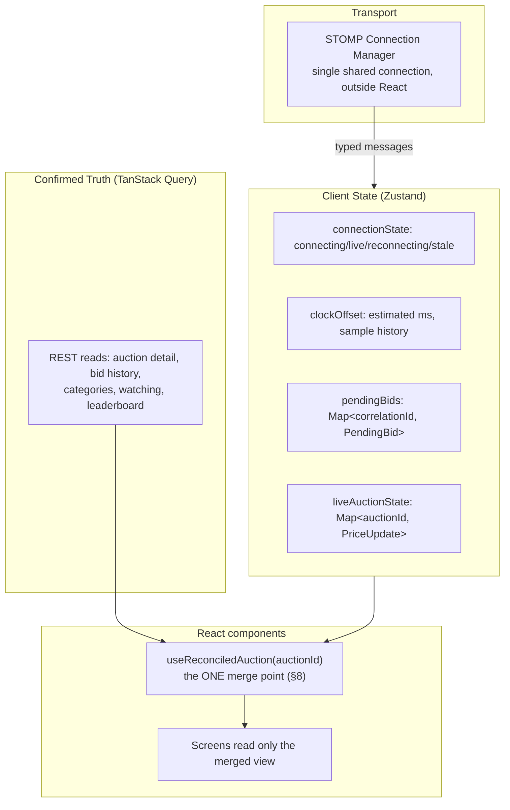
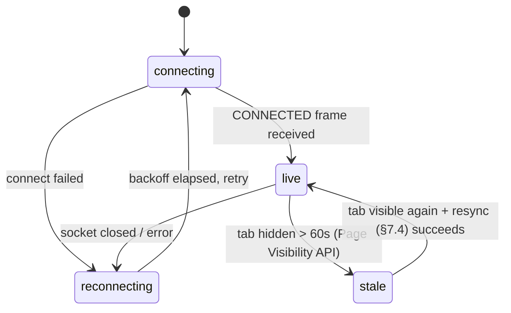

# Project Design Requirements (PDR) — BidStream Web Client

| Field | Value |
|---|---|
| **Project name** | BidStream Web Client — the reference frontend for the Real-Time Auction Platform |
| **Document type** | Project Design Requirements / Technical Design Document |
| **Version** | 1.1 |
| **Status** | Draft for build |
| **Target stack** | React 18 + TypeScript (Vite), TanStack Query, `@stomp/stompjs`, Zustand, Tailwind + shadcn/ui |
| **Backend contract** | `PDR-RealTimeAuctionPlatform.md` v1.5 — REST + WebSocket surface verified against the running code, not the PDR's memory of itself (see §4) |

> **Companion document, not a rewrite.** This PDR assumes the backend PDR's vocabulary (auction lifecycle, `occurredAt`, the outbox, the tick) without re-deriving it. Where this document says "the backend guarantees X," that guarantee has been independently verified against the running code — see §4 for the citation trail.

**v1.1 revision note.** An external staff-level review of v1.0 found one gate-worthy gap and several smaller ones, all addressed below: §4.2/§8.3 now enforce strict `version` monotonicity instead of an unresolvable "freshest by timestamp" (the backend gained a matching `version` field in its own v1.5, tracked precisely as *specified, not yet independently re-verified* until that backend work ships — see the inline note in §4.2); §9 now states that a terminal REST `status` on resync overrides a possibly-missed one-shot `AUCTION_ENDED` frame; §10.1's code sample no longer contradicts its own prose about a one-way clock estimate; §12.1 resolves the winner-masking/leaderboard-identity inconsistency the review caught, against the backend's own now-explicit position that it doesn't pseudonymize identity anywhere.

---

## 0. Why this document exists

The backend earned its rigor by being reviewed against exactly the failure modes that break real systems — crash windows, replay, clock skew, connection loss — rather than against a checklist of features. A frontend built against this backend inherits every one of those failure modes at the UI layer: an async decision that hasn't arrived yet, a client clock that's wrong, a WebSocket that drops mid-auction. **A frontend that handles the happy path but hand-waves those is not "done," it's untested** — the same standard the backend was held to in its own QA rounds.

This document specifies the frontend with that standard: architecture decisions stated with their reasoning, the genuinely hard parts named and designed (not deferred to "we'll figure it out"), and a build order that gets the highest-risk piece — the WebSocket/reconciliation layer — right before anything is built on top of it.

---

## 1. Executive Summary

The BidStream Web Client is a single-page React application that gives buyers and sellers a real-time view of the auction platform: live prices, honest asynchronous bid confirmation, a server-synchronized countdown, and a connection state the user can actually see and trust. It is built around four ideas, each answering a specific way the backend's own design could be misrepresented by a naive client:

1. **Confirmed state and optimistic state are never the same variable.** The backend's price/winner is the only truth; a client's own pending bid is an *annotation* on top of that truth, never a replacement for it. This mirrors the backend's own Redis-is-a-projection/Postgres-is-truth split (§9 of the backend PDR) at the UI layer.
2. **The client clock is cosmetic, and the UI has to actually behave like it knows that.** The backend computes nothing from a client's clock (backend PDR §15.5); a frontend that runs a countdown against raw `Date.now()` quietly reintroduces the exact problem the backend went to the trouble of eliminating.
3. **Connection state is a first-class, visible thing**, not an implementation detail. A dropped WebSocket that silently leaves stale numbers on screen is a correctness bug with a UI, not a UX nicety to skip.
4. **Broadcast volume discipline extends to the client.** The backend coalesces bid volume into a bounded tick (backend PDR §15.3); a client subscribed to many auctions at once (a Browse page) needs its own coalescing so that discipline isn't undone by React re-rendering on every incoming frame.

This PDR specifies requirements, architecture, the state/data model, the WebSocket and reconciliation design in full (the two riskiest pieces), every screen's data contract, error handling, testing strategy, and a phased build order.

---

## 2. Goals and Non-Goals

### 2.1 Goals

- Real-time price/status updates that read as live, not laggy or janky, on every screen that shows an auction.
- A bid's lifecycle (submitted → pending → accepted/rejected/outbid) is always visible and never lies — no state where the UI implies a result the backend hasn't actually confirmed.
- A countdown that shows the same critical final seconds to every user, regardless of local clock drift.
- A connection state the user can see, with automatic, bounded recovery.
- Accessible by default: live regions that announce without spamming, keyboard-operable bid flow.
- Testable async paths — the WebSocket/reconciliation layer is unit- and integration-tested on its own, not only exercised incidentally through UI tests.

### 2.2 Non-Goals (v1)

- **Server-side rendering / SEO.** A CSR SPA is the right tradeoff here (§5.1) — the interesting surface area is the live bid widget, not indexable listing pages. Revisit only if organic discovery of listings becomes a real product goal, matching the backend's own "don't build ahead of a demonstrated need" discipline (backend PDR §20).
- **Native mobile apps.** Explicitly out of scope on the backend side too (backend PDR §2.2); this is a responsive web client.
- **Offline support.** An auction is inherently a live, connected activity — there is no meaningful "offline bid."
- **Multi-currency / i18n.** The backend is USD-only today (`AuctionController` hardcodes `Currency.getInstance("USD")`); the frontend matches that scope rather than building UI for a currency selector nothing behind it supports.
- **Admin category-management UI.** `POST /categories` exists and is `ROLE_ADMIN`-gated, but a full admin console is disproportionate to what's actually needed for v1 — an admin can create categories via Swagger UI or a raw request for now. Named here so it isn't quietly assumed to be part of the Sell/Browse build.
- **Payment/checkout UI.** The backend stubs settlement (backend PDR §2.2); there is nothing on the backend for a payment screen to call.

---

## 3. Functional Requirements

Each requirement is traced to the backend capability it depends on, so a gap in either document is visible immediately.

| ID | Requirement | Backend dependency |
|---|---|---|
| FE-1 | A user can register, log in, and stay logged in across a page reload (refresh-token flow). | `POST /auth/register`, `/login`, `/refresh` |
| FE-2 | A seller can create an auction (title, description, category, prices, schedule, anti-snipe window). | `POST /auctions`, `GET /categories` |
| FE-3 | Any visitor can browse, filter (status/category), search (keyword), and sort auctions; a seller can see their own listings via the same view. | `GET /auctions?status=&category=&sellerId=&q=` |
| FE-4 | A logged-in buyer can place a bid on an OPEN/EXTENDED auction and see its outcome (accepted/rejected/outbid) without a page reload, correlated to the specific bid they placed. | `POST /auctions/{id}/bids` (default async 202), `/user/queue/notifications` |
| FE-5 | A buyer can set, view, and cancel an auto-bid (proxy) maximum for an auction. | `POST`/`DELETE /auctions/{id}/auto-bid` — **see §12.1: no `GET`, a real backend gap this document does not paper over** |
| FE-6 | Every visitor watching an auction's page sees price, high bidder, and countdown update live, and sees an immediate, unmissable notice when the auction extends or ends. | `/topic/auctions/{id}`: `PRICE_UPDATE`, `AUCTION_EXTENDED`, `AUCTION_ENDED` |
| FE-7 | A bidder who is outbid sees a targeted notice, distinct from the general price feed. | `/user/queue/notifications`: `OUTBID` |
| FE-8 | A user can bookmark ("watch") an auction and see all watched auctions in one place, independent of whether they currently have that auction's page open. | `POST`/`DELETE /auctions/{id}/watch`, `GET /me/watching` |
| FE-9 | A user can view their own bid history and current standing (winning/outbid/lost/won) across all auctions. | `GET /me/bids` |
| FE-10 | The countdown a user sees is correct relative to the server's clock, not their own device's clock. | `serverNow` on every `/topic/auctions/{id}` message |
| FE-11 | A user who loses connectivity mid-auction is told so, and is never shown a stale price as if it were live. | Connection lifecycle FSM (§9) |

---

## 4. The verified contract (read this before building anything)

This section exists because the backend PDR's own §14 went unaudited for three revisions while §9/§10/§19 were revised repeatedly — and a frontend built against the *literal* backend PDR text, rather than the actual running code, would have shipped against at least one wrong assumption (see backend PDR v1.4's revision history for the full account of that gap). Everything below was read directly from the current backend source, not from memory of the spec.

### 4.1 REST surface (`/api/v1`)

| Method & path | Auth | Notes |
|---|---|---|
| `POST /auth/register` | – | `201`, empty body. Call `/login` after — no tokens are returned here. |
| `POST /auth/login`, `POST /auth/refresh` | – | `{accessToken, refreshToken, tokenType:"Bearer"}`. Access TTL 15 min, refresh TTL 7 days. |
| `GET /auctions` | – | `status`, `category`, `sellerId`, `q` — all optional, all compose via `AND`. Standard `Pageable` params (`page`, `size`, `sort`). |
| `GET /auctions/{id}` | – | Full detail incl. current price/winner/status/version. |
| `GET /auctions/{id}/bids` | – | Paginated, newest-first bid history. |
| `GET /auctions/{id}/leaderboard?limit=` | – | `[{bidderId, amount}]`, top-N. |
| `GET /categories` | – | `[{id, name, slug}]`. |
| `POST /categories` | `ROLE_ADMIN` | Out of scope for v1 UI (§2.2) — noted for completeness. |
| `POST /auctions` | `ROLE_SELLER` | Every registered user has this role (backend grants both `ROLE_USER` and `ROLE_SELLER` at registration) — there is no seller-application flow to design a screen for. |
| `PATCH /auctions/{id}` | owner | Only while `DRAFT`/`SCHEDULED`. |
| `POST /auctions/{id}/cancel` | owner or `ROLE_ADMIN` | Only while `SCHEDULED`/`OPEN`. |
| `POST /auctions/{id}/bids` | user | Body `{amount}` (string or number; send as a decimal string to avoid float formatting surprises). **Default response: `202 {bidId, status:"PENDING", correlationId}`.** `?wait=true` opts into a synchronous wait — **do not use it** (§8.4). |
| `POST`/`DELETE /auctions/{id}/auto-bid` | user | Set/cancel. No `GET` — see §12.1. |
| `POST`/`DELETE /auctions/{id}/watch` | user | Both idempotent (`204` either way, including unwatching something never watched). `POST` on an unknown auction is `404`. |
| `GET /me/bids` | user | All of the caller's bids, across auctions. |
| `GET /me/watching` | user | All watched auctions, all statuses, ordered by `endTime`. |

**Errors — RFC 7807 everywhere**, via `GlobalExceptionHandler`. Two shapes to code against by name:
- A validation `400` carries `errors: {field: message}`.
- A bid-rejection `409` carries `reason`, `currentPrice`, `minIncrement` as extra properties — render "you need at least $X" directly from these, don't re-derive it client-side.
- A `429` (rate limit) carries `reason:"RATE_LIMITED"` and no `retryAfterMs` — confirmed correct as of backend PDR v1.5, which corrected its own §14.2 example to match the running code rather than leave this document as the only place noting the discrepancy. Show a generic "slow down" message and let the user retry manually.

### 4.2 WebSocket — `/ws`, STOMP

Auth: `Authorization: Bearer <token>` as a **native STOMP header on the `CONNECT` frame**, verified once, at connect time only. There is no mid-session reauthentication — a 15-minute access token does not force a disconnect. Practical consequence for the connection manager (§7): refresh the token *before* a reconnect attempt if it's stale, but don't build any "is my token about to expire, should I proactively reconnect" logic — the backend genuinely doesn't need it.

Destinations and **exact, verified** payload shapes:

**Verification status note (added in v1.1).** Every field below except `version` was read directly from running backend code (v1.4) and is fact. `version` reflects backend PDR v1.5, a *specification* written in response to this document's own staff review, not yet independently re-verified against a running deploy the way the rest of this table was — treat it as "the contract the frontend must be built against," and re-confirm it against the actual `TickBroadcaster`/`PriceUpdateMessage` output before Phase 1 (§18) is considered done, the same way every other row in §4 was confirmed rather than assumed.

```ts
// /topic/auctions/{id} — broadcast, no auth needed to receive once subscribed
type PriceUpdate = {
  type: "PRICE_UPDATE";
  auctionId: string;
  price: string;        // decimal string — never Number() this for logic, only for display formatting
  winnerId: string | null;
  endTime: string;       // ISO instant
  version: number;       // auctions.version — the ONLY field that establishes ordering between two
                         // confirmed states (§8.3). serverNow is a send-time, not a state counter,
                         // and must never be used to decide which of two states is newer.
  serverNow: string;     // ISO instant — the clock-offset module's input (§10)
};

type AuctionExtended = {
  type: "AUCTION_EXTENDED";
  auctionId: string;
  newEndTime: string;
  version: number;
  serverNow: string;
};

type AuctionEnded = {
  type: "AUCTION_ENDED";
  auctionId: string;
  outcome: "SOLD" | "UNSOLD";
  winnerId: string | null;
  finalPrice: string | null;
  version: number;
  serverNow: string;
};

// /user/queue/notifications — targeted, per-user
type Outbid = {
  type: "OUTBID";
  auctionId: string;
  newPrice: string;      // note: newPrice here, NOT price
};

type BidResult = {
  type: "BID_RESULT";
  correlationId: string;
  // NOT two separate fields. One string: either the literal "ACCEPTED", or
  // "REJECTED:<REASON>" — e.g. "REJECTED:BELOW_MIN_INCREMENT". This is the one
  // real drift from the backend PDR's own §15.2 example (which only ever shows
  // the ACCEPTED case) — parse it with status.split(":") in exactly one place
  // (§8.3), never inline at a call site.
  status: string;
};
```

### 4.3 The three things this document refuses to build around a guess

1. **`retryAfterMs` on `429`.** Not sent. Build the generic message now; add the countdown if the backend ever sends the field, not before.
2. **A `GET` for a user's own auto-bid.** Doesn't exist, on this auction or any other. §12.1 specifies the workaround precisely rather than assuming a fix is coming.
3. **A public per-bid activity broadcast.** Never existed, and the backend PDR (§15.3) explicitly designed against it for scalability reasons. A "someone just bid $X" live feed is not this backend's contract — §11.3's activity feed design is a polling reconstruction, not a broadcast subscription, and is scoped that way on purpose.

---

## 5. Technology Stack & Justification

| Concern | Choice | Why |
|---|---|---|
| Framework | **React 18 + TypeScript, Vite** | CSR SPA (§2.2/§5.1) fits a live-data-heavy app better than SSR; Vite for fast local iteration. |
| Server-state (REST) | **TanStack Query** | Caching, request dedup, and refetch-on-reconnect (§9) are exactly its job. Deliberately **not** used to hold live WebSocket data — see §5.1. |
| Live-channel transport | **`@stomp/stompjs`**, wrapped in a hand-written connection manager (§7) | It's a thin, well-maintained STOMP client; the value-add this project needs (typed contracts, reconnect policy, resubscription, resync) is deliberately hand-rolled rather than assumed to exist in a library. |
| Client-only state | **Zustand** | Connection status, clock offset, and the pending-bid overlay are small, don't need Redux's ceremony, and benefit from selectors that don't re-render unrelated components. |
| UI components | **Tailwind + shadcn/ui** | Effort goes into behavior (the hard parts below), not bespoke CSS or a component library evaluation. |
| Testing | **Vitest + React Testing Library** (unit/component), **a mock STOMP broker** (integration, §14.3), **Playwright against the real local stack** (e2e, §14.4) | Mirrors the backend's own "test against the real thing, not a simulation, wherever the risk actually lives" discipline (backend ADR-0003). |

### 5.1 Why not route live data through TanStack Query's cache

It's tempting — Query already has a cache and a subscription model. It's wrong here for a specific reason: Query's mental model is *request → response → cache entry*, invalidated and refetched. A `PRICE_UPDATE` isn't a response to a request; it's a push with no request behind it, arriving on an independent cadence (the tick, not a query's own refetch interval). Forcing it through `queryClient.setQueryData` on every tick works, but it means the one place your app's live-data invariants live is a generic cache API that doesn't know anything about STOMP reconnects, clock offsets, or pending-bid overlays. **Confirmed state (via Query, from REST) and live state (via the connection manager, from WebSocket) are kept in two explicitly different places, merged by one explicit layer (§8) — not blended into one cache and hoped to stay consistent.**

---

## 6. Architecture



**Why this shape, stated as plainly as the backend states its own:** every screen reads a *merged* view through one hook, never the raw WebSocket state and never the raw REST cache directly. That single seam is what makes the reconciliation rule (§8) enforceable and testable in one place instead of re-implemented, slightly differently, in every component that touches live data — the same reasoning the backend applies to putting every bid decision through one aggregate method (`AuctionItem.placeBid`) rather than letting every adapter reimplement the invariants.

---

## 7. The WebSocket Connection Manager

This is the highest-risk piece, and the one this document specifies in the most detail — matching how the backend PDR devotes its most detailed section (§9) to its own highest-risk piece.

### 7.1 Responsibilities

A single module, instantiated once, outside React's render tree (a plain singleton or a context provider that never re-creates it):

1. Owns exactly one STOMP connection.
2. Maintains a **subscription registry**: `Map<destination, Set<callback>>`. Components subscribe/unsubscribe via a hook (`useAuctionChannel(auctionId)`); the manager only actually sends a STOMP `SUBSCRIBE` frame the first time any component asks for a given destination, and only sends `UNSUBSCRIBE` when the last one stops asking — reference-counted, not per-component.
3. Parses every inbound frame against the typed contracts in §4.2 and fans it out only to callbacks registered for that exact destination.
4. Owns the connection lifecycle state machine (§9) and exposes it read-only to the Zustand store.
5. **Never touches React state directly** — it writes into the Zustand store; components read the store. This keeps the manager testable with zero DOM/React involved (§14.1).

### 7.2 Auth

- On connect, read the current access token from wherever the auth module keeps it. If it's expired, refresh it first (reusing the same refresh logic the REST client uses) — a WebSocket connect with an expired token fails the same way an expired-token REST call would.
- Per §4.2, this only matters *at connect time*. No mid-session token-expiry handling is needed or built.

### 7.3 Reconnection policy

Exponential backoff with jitter: `1s, 2s, 4s, 8s, 16s, capped at 30s`, jitter ±20% to avoid a thundering herd if many tabs drop at once (e.g., a shared network blip). Reset to `1s` on any successful connect. No maximum retry count — a live auction page that gives up reconnecting after N tries and just sits broken is worse than one that keeps trying quietly in the background.

### 7.4 The resync rule — non-negotiable

**On every reconnect, before resuming the live stream, refetch the current state of every subscribed auction via REST, and only then resubscribe.** This is directly analogous to the backend's own working-set seeding rule (backend PDR §9.6: "decisions read committed Postgres, never a possibly-stale Redis") — the frontend's own "possibly-stale Redis" is whatever it displayed before the drop. Concretely: on reconnect, for each `auctionId` with an active subscriber, call `GET /auctions/{id}` (and invalidate the relevant Query cache entries) before re-subscribing to `/topic/auctions/{id}`. The UI shows a "reconnecting…" state (§9) for the gap, never a silently-stale price.

**A terminal REST `status` on that resync fetch overrides a missed `AUCTION_ENDED` — required, v1.1 addition.** `AUCTION_ENDED` (backend PDR §15.3) is a *single* immediate push that bypasses the tick; it is never sent again after the fact. If a disconnect happens to straddle the exact moment that frame would have arrived, resubscribing afterward guarantees nothing — no further end-of-auction frame is ever coming. The resync fetch itself is the safety net: `GET /auctions/{id}` returns `status` (backend PDR §11.1: `SOLD`/`UNSOLD`/`CANCELLED` are terminal), so **if the resync response carries a terminal status, end the auction in the UI immediately from that response, regardless of whether an `AUCTION_ENDED` frame was ever seen.** This composes directly with §8.3's version rule — a terminal REST response necessarily carries the auction's final, highest `version`, so it always wins the monotonicity check against anything the client had displayed before the drop.

---

## 8. Reconciliation — confirmed truth vs. the optimistic overlay

### 8.1 The rule, stated once, precisely

> **The displayed price and winner always come from confirmed state (REST fetch or a WebSocket `PRICE_UPDATE`/`AUCTION_ENDED`). A pending bid is rendered only as an annotation — "your bid of $X is pending" — layered on top, never substituted for the confirmed number, and it is removed the instant a `BID_RESULT` or a `PRICE_UPDATE` reflecting it arrives, whichever comes first.**

This is the frontend's version of the backend's own hardest-won invariant (backend PDR §9.6, §19): never let a projection that might be ahead of the truth be mistaken for the truth. The backend's phantom-price bug and a frontend showing "You won!" on an optimistic assumption that later gets reversed are the same class of mistake in two different tiers of the same system.

### 8.2 State shape

```ts
type PendingBid = {
  correlationId: string;
  auctionId: string;
  amount: string;
  submittedAt: number;       // client timestamp, for the timeout in §8.4
};

type ReconciledAuctionView = {
  confirmed: { price: string; winnerId: string | null; endTime: string; version: number };
  myPendingBid: PendingBid | null;                 // this caller's own in-flight bid, if any
  connectionState: ConnectionState;                // surfaced so the UI can show it (§9)
};
```

### 8.3 The merge algorithm (`useReconciledAuction`) — version-monotonic, not timestamp-ordered

**v1.1 correction.** v1.0 said to take "the latest… by timestamp." That rule doesn't actually work: the only timestamp available, `serverNow`, is a *broadcast* instant, not a *state* counter — two messages can carry increasing `serverNow` while representing the same or an out-of-order state, and a REST resync response has no natural ordering against an in-flight tick by timestamp at all. This is precisely the class of bug the backend's own v1.3 eliminated at its tier (deciding from a possibly-stale Redis projection instead of committed Postgres) resurfacing at the UI tier for want of the same ordering primitive. The fix is the same shape: **use the version, never the clock.**

1. Track one number per auction: `displayedVersion`, initialized from whichever confirmed state is applied first (a REST fetch on mount, typically).
2. On any incoming confirmed state — a REST response or a `PRICE_UPDATE`/`AUCTION_EXTENDED`/`AUCTION_ENDED` frame — compare its `version` to `displayedVersion`. **Apply it, and update `displayedVersion`, only if the incoming `version` is strictly greater. Otherwise discard the incoming state entirely and keep what's already displayed.** No exceptions, no "unless it's from REST so it must be newer" special case — a REST fetch racing a buffered tick is exactly the scenario this rule exists to make safe, and it has no other way to know which one actually is newer.
3. If the current user has an entry in `pendingBids` for this `auctionId`, attach it as `myPendingBid`. Nothing about the confirmed price/winner/version is altered by its presence.
4. On a `BID_RESULT` message: parse `status` (`"ACCEPTED"` or `"REJECTED:<reason>"` — one `parseBidResult(status)` helper, used everywhere `BID_RESULT` is handled, so the string format in §4.2 is never re-parsed ad hoc), remove the matching `correlationId` from `pendingBids`, and surface a toast/inline result. The confirmed price/version itself is updated by the *next* qualifying `PRICE_UPDATE` (step 2), not by this message — `BID_RESULT` tells the bidder about their bid, it does not carry the new authoritative state.
5. On an `OUTBID` message for an auction with a live pending bid from this user: clear the pending overlay immediately (their bid already lost, waiting further is pointless) and surface the notice. `OUTBID` carries no `version` and updates no confirmed state — it is purely a targeted notice; the confirmed price/winner change it describes arrives separately, through step 2, from the `PRICE_UPDATE` produced by the same backend-side decision (backend PDR §11.3: bids and their effects are decided by one ordered writer, so `OUTBID` and the `PRICE_UPDATE` that reflects it cannot disagree about *what* happened — only their *delivery* order across two different destinations is unguaranteed, which is exactly what step 2's version check makes safe regardless of which arrives first).

**Recommended, not required (v1.1 addition):** to close the up-to-one-tick gap where a `BID_RESULT: ACCEPTED` can render before the confirming `PRICE_UPDATE` (the notice arrives immediately via the outbox relay; the price update waits for the next ~250ms tick — backend PDR §10.3, §15.3), synthesize a short-lived "you're now winning at $X" from the result plus the bidder's own submitted amount, explicitly rendered as a continuation of the pending-overlay affordance (§8.1's rule still holds — this is an annotation, not a substitute for confirmed state) and superseded the instant the next qualifying `PRICE_UPDATE` arrives. Skip this for v1 if it doesn't earn its complexity; the underlying inconsistency is cosmetic, self-corrects within one tick, and was correctly triaged as non-blocking.

### 8.4 Timeout — what "still processing" means, and why not `?wait=true`

A pending bid with no `BID_RESULT` after **10 seconds** (chosen deliberately generous — decision latency has no contractual upper bound on the async path, unlike the backend's own internal 5s `SYNC_WAIT_TIMEOUT` for the `?wait=true` path this frontend doesn't use) switches its UI from "confirming…" to "still processing — you'll be notified," and stops blocking any other interaction. It is **never** reinterpreted as a failure, and never silently retried — a bid already durably in Kafka must not be resubmitted. This is exactly why `?wait=true` is refused in §4.1: reaching for it under the temptation of "just make the UI simpler" would collapse this entire section back into the synchronous, wrong shape the backend PDR itself warns against (backend PDR §14.2, §25's risk table).

---

## 9. Connection Lifecycle — a real, visible state machine



| State | What the user sees | What the manager does |
|---|---|---|
| `connecting` | A subtle "connecting…" indicator; cached/REST data still shown, clearly labeled as not-yet-live. | Attempting the initial STOMP connect. |
| `live` | No chrome — this is the normal state and shouldn't announce itself. | Streaming; ticks and targeted messages flow normally. |
| `reconnecting` | A visible (not alarming) banner: "Reconnecting…" — the last-known price stays on screen but is visually marked as **not live** (e.g., a muted/greyed price, not just an unlabeled stale number). | Exponential backoff (§7.3). |
| `stale` | A tab that's been backgrounded long enough that its data can no longer be trusted as current — same treatment as `reconnecting` visually, entered proactively rather than waiting for the socket to actually drop. | On foregrounding: full resync (§7.4) before relabeling `live`. |

**Why `stale` is a separate state from `reconnecting`.** A backgrounded browser tab can have a WebSocket that's technically still open (no error, no close event) while the tab was simply not rendering — the underlying OS/browser may throttle timers but not always tear down the socket. Treating "I haven't been visible in a while" as equivalent to "I actually disconnected" and forcing a resync either way is the safer default: it costs one extra REST fetch on foreground and prevents ever displaying a number that's silently minutes old with no visual indication.

---

## 10. Server-Authoritative Clock Offset

Directly implementing backend PDR §15.5 and this repo's own root README ("Real-time contract" section) — restated here with the exact algorithm because a countdown timer is exactly the kind of thing that's easy to build wrong in a way that *looks* right until the final seconds of a real auction.

### 10.1 The algorithm

**v1.1 correction.** The code below previously computed a round-trip midpoint (`(sentAt + receivedAt) / 2`) despite the prose immediately after it explaining that no round trip exists to measure — a `PRICE_UPDATE` is a server-initiated push with no client-sent request behind it, so there was never a real `sentAt` to average against. The formula and the reasoning disagreed with each other; only the reasoning was right. The code now matches it exactly:

```ts
type OffsetSample = { offsetMs: number; observedAt: number };

// Called every time any message carrying serverNow arrives (every PRICE_UPDATE tick,
// AUCTION_EXTENDED, AUCTION_ENDED) — NOT only once at connect. This is a ONE-WAY estimate:
// there is no client-sent request behind a broadcast push, so there is no round trip to
// measure and no midpoint to compute — offset is simply serverNow minus local receive time.
function recordSample(serverNow: string, receivedAt: number): OffsetSample {
  const offsetMs = new Date(serverNow).getTime() - receivedAt;
  return { offsetMs, observedAt: receivedAt };
}

// Smoothed over the last N samples (N=5) via median, not mean — a single network-jitter
// outlier (one slow tick) should not visibly jump the countdown; median is robust to exactly
// that, where a mean would drag the whole estimate toward one bad sample. Note what this does
// NOT protect against: a sustained, asymmetric latency trend (not a single outlier) will pull
// the median along with it just as it would a mean — median-of-5 defends against jitter noise,
// not against a real, ongoing drift. That's an accepted gap, not a guarantee overclaimed as
// airtight: the countdown's tolerance is generous enough that this doesn't matter in practice,
// and the guaranteed final push (backend PDR §15.3) is what actually makes the last moment
// exact, independent of how well this smoothing performed up to that point.
function estimateOffset(samples: OffsetSample[]): number {
  const recent = samples.slice(-5).map(s => s.offsetMs).sort((a, b) => a - b);
  return recent[Math.floor(recent.length / 2)];
}

// What every countdown actually renders against:
function correctedNow(offsetMs: number): number {
  return Date.now() + offsetMs;
}
```

This is a real, stated simplification, not an oversight: folding one-way network latency into the offset estimate (rather than cancelling it out via round-trip symmetry) is accepted because the backend's own tick interval (250ms default) supplies a fresh sample roughly four times a second, keeping any single sample's latency error from visibly persisting. A true round-trip measurement would require an application-level ping/pong the backend doesn't currently expose — not worth adding for a problem the tick cadence already solves well enough.

### 10.2 Edge cases

- **Before the first sample arrives:** show the countdown against the raw, uncorrected `endTime` with a small "syncing…" indicator rather than blocking the whole page on an offset that hasn't been computed yet. The correction kicks in on the first tick, typically within one tick interval of page load.
- **The final seconds:** the countdown re-renders every 100ms locally (a local `setInterval`/`requestAnimationFrame` loop against `correctedNow()`), not only on each server tick — smooth on screen, corrected in substance. `AUCTION_ENDED`'s guaranteed immediate push (backend PDR §15.3) is what makes the last moment exact regardless of tick timing.
- **Tab backgrounding:** browsers throttle `setInterval` in hidden tabs; don't fight this. The countdown simply catches up (jumps to the correct remaining time) on `visibilitychange`, using the connection manager's resync (§9) to also refresh confirmed state at the same moment.

---

## 11. Client-Side Tick Coalescing

The backend bounds broadcast to one `PRICE_UPDATE` per auction per ~250ms tick (backend PDR §15.3). That discipline is only as good as what the client does with each message — a Browse page subscribed to 30 auctions, each ticking independently, can still produce 30 uncoalesced React re-renders inside the same 250ms window if nothing on the client batches them.

**Design:** all inbound WebSocket messages are buffered into a small queue by the connection manager; a single `requestAnimationFrame` callback drains the queue and applies all buffered updates to the Zustand store in one batch, once per frame (at most ~60 times/second, in practice far less since ticks are ~250ms apart). This guarantees React never re-renders more often than the browser can actually paint, regardless of how many auctions are being watched at once or how bursty the incoming messages are — the client-side mirror of the backend's own "the hot path never gates on the slow resource" principle (backend PDR §5.1), applied to render cost instead of I/O cost.

---

## 12. Screens

Each screen names its exact data sources so there is never a gap between "what the design assumes" and "what the API actually provides" — the mistake that produced the earlier watch/category/search gaps on the backend side.

### 12.1 Live Auction Room — the centerpiece

**Purpose:** everything FE-4, FE-6, FE-7, FE-10 need in one place.

**Data sources:** `GET /auctions/{id}` (initial paint + resync), `GET /auctions/{id}/bids` (history panel), `GET /auctions/{id}/leaderboard` (optional top-bidders widget — a real endpoint the earlier frontend planning discussion hadn't accounted for), `/topic/auctions/{id}` (live), `/user/queue/notifications` (this user's own bid outcomes).

**Must show:** current price, high bidder, server-synced countdown (§10), the bid form with its full pending/confirmed/rejected/outbid state machine (§8), a visible connection indicator (§9), and an unmissable, distinct visual moment for `AUCTION_EXTENDED` (the anti-snipe mechanic is otherwise invisible — this is the one moment in the whole app worth a deliberate animation, not because it's decorative but because it's the single UI moment that actually explains *why* the auction didn't end when the countdown seemed to say it would).

**Bidder-identity display — one policy, applied everywhere, not decided per-widget (v1.1 correction).** v1.0 said to mask `winnerId` here as "a bidder" while §12.1's own leaderboard widget renders `GET /auctions/{id}/leaderboard`'s raw `bidderId` unmasked — an inconsistency an external review caught. The backend PDR (§13, v1.5) is now explicit about its own position: **it does not pseudonymize bidder identity anywhere** — `winnerId`, `currentWinnerId`, and `bidderId` are the same raw UUID everywhere the API returns one, and any masking is a client-side presentation choice the API makes no guarantee about (the raw ID is always visible in the network tab regardless of what's rendered). Given that, the frontend's own choice has to be internally consistent rather than accidentally split across two widgets on the same screen. **Decision: apply one small, deterministic, purely cosmetic display function — `displayHandle(id) → "Bidder " + id.slice(0, 6)"` — everywhere a bidder identity would otherwise render, including this room's high-bidder display and the leaderboard, and label it nowhere as a privacy feature, only as a readability one** (a UUID is not pleasant to read next to a price; a short deterministic handle is, and it happens to also avoid gratuitously displaying a raw ID, without pretending that's a real privacy boundary). If bidder privacy is ever a genuine product requirement rather than a readability preference, that's server-side work — tracked as a future enhancement in the backend PDR (§26), not something a client-side display function can actually provide.

**Auto-bid setup — the one real, unresolved backend gap.** There is no `GET` to read back a user's own standing auto-bid maximum, for this auction or any other (§4.3). The honest options, stated rather than glossed over:
- (a) Treat the "set auto-bid" form as write-only per visit — a returning user simply doesn't see what they previously set, and re-submitting a new max always fully replaces the old one (which the backend does correctly support — "set/replace").
- (b) Persist the last-submitted max in client-side storage (`localStorage`, keyed by `auctionId`) purely as a *display hint*, clearly labeled as "you last set $X" rather than "your current max is $X" — since client storage can drift from server truth (a different device, a cleared cache) and must never be presented as authoritative.
- **Decision for v1: (b), with the explicit label distinction.** It's a strictly better user experience than (a) for near-zero cost, as long as the UI is honest that it's a local memory, not a server fact — the same "never let an approximation masquerade as the truth" principle as §8.1, applied to a smaller stake.

### 12.2 Browse / Listings

**Data sources:** `GET /auctions?status=&category=&q=&sort=` (REST, paginated), `GET /categories` (filter chips), then `/topic/auctions/{id}` for every auction currently rendered on screen (subscribed on mount, unsubscribed on scroll-out or unmount, via the reference-counted registry in §7.1 — a card that's been paginated away stops costing anything).

**Sort:** the backend's `Pageable` binds a generic `sort` param (e.g. `sort=endTime,asc` for "ending soon") — there is no bespoke `sort=endingSoon` alias server-side (backend PDR §14.1's example query uses that alias in prose only; the real parameter is Spring's generic field-based sort). The frontend's "Ending Soon" sort control sends `endTime,asc` directly; don't build or expect a friendly-alias endpoint that doesn't exist.

### 12.3 My Activity

**Two tabs, two independent data sources, not one merged endpoint (because none exists that merges them):** "My Bids" from `GET /me/bids`; "Watching" from `GET /me/watching`. Each auction row in "Watching" gets its own live subscription exactly as in Browse (§12.2) — reusing the same subscribed-card pattern rather than inventing a separate one.

### 12.4 Sell — Create Auction & My Listings

**Create:** a form against `POST /auctions`, with `GET /categories` populating the category select (not a free-text field — categories are admin-curated by design, backend PDR §14.4, and the UI should reflect that rather than inviting a seller to type a category name that will be silently ignored).

**My Listings:** `GET /auctions?sellerId={currentUserId}` — the filter added specifically for this view. This is the one screen in this document whose data dependency didn't exist until very recently; naming that here is deliberate, matching the same "endpoint named without a domain model behind it" failure mode this whole planning process has been careful to avoid repeating.

### 12.5 Auth

Standard login/register forms against `/auth/login`, `/auth/register`. Token storage: access token in memory (a module-level variable or a React context, **not** `localStorage`, to reduce XSS exposure of a live bearer token); refresh token in an `httpOnly` cookie if the backend is ever extended to set one, or in `localStorage` as a pragmatic fallback today since the backend currently returns it as a plain JSON field with no cookie mechanism — noted here as a real gap between "best practice" and "what the backend actually gives the frontend to work with," not silently upgraded past what's real.

---

## 13. Error Handling Matrix

| Condition | Cause | UI behavior |
|---|---|---|
| REST `401` | Access token expired mid-session | Silent refresh via `/auth/refresh`, retry the original request once. On refresh failure, redirect to login. |
| REST `403` | Role/ownership check failed (e.g., non-seller hitting `POST /auctions`) | Inline error; this should be rare since the UI shouldn't offer the action to begin with — treat it as a bug-signal (log it) as well as showing a message. |
| REST `404` | Resource genuinely gone (e.g., watching a since-deleted auction id) | "Not found" state, not a crash. |
| Bid `409` | `BidRejectedException` — `reason`, `currentPrice`, `minIncrement` in the body | Inline, specific message built from those fields (§4.1) — e.g. "Bids must be at least $135.00." |
| `429` | Rate limited | Generic "Please slow down and try again" — no fabricated countdown (§4.3). |
| Validation `400` | `errors: {field: message}` | Map straight onto form fields; this is the exact shape the backend's own `MethodArgumentNotValidException` fix (backend QA round) produces. |
| WS connect failure | Bad/expired token, network down | Falls into `reconnecting` (§9); if it's specifically an auth failure (not just network), surface a distinct "please log in again" rather than retrying a doomed connection forever. |
| WS drop mid-bid | Connection lost after a bid was submitted but before `BID_RESULT` arrives | The pending overlay (§8) persists through the drop — the bid is durably in Kafka regardless of the client's connection state — and resolves normally once reconnected and resynced; the "still processing" timeout (§8.4) covers the same case whether the delay is server-side or connection-side, so no special handling is needed here beyond what §8.4 already does. |

---

## 14. Testing Strategy

| Level | Tools | What it covers |
|---|---|---|
| Unit | Vitest | The clock-offset module (§10) in isolation — feed it synthetic samples, assert the median-of-5 smoothing and the "before first sample" fallback; the reconciliation merge function (§8.3) as a pure function of (confirmed, pending, incoming message) → next state, with no React or network involved. |
| Component | Vitest + React Testing Library | The bid form's full state machine (idle → submitting → pending → accepted/rejected/timed-out), driven by mocking the reconciliation hook's output directly rather than a real connection. |
| Integration | A mock STOMP broker (`@stomp/stompjs` supports a local in-memory broker for exactly this) | Scripted message sequences: a tick immediately followed by an `AUCTION_ENDED` (does the final-push guarantee actually short-circuit the tick-based render?), an `OUTBID` arriving while a pending bid is in flight, a simulated disconnect mid-bid followed by reconnect (does resync — §7.4 — correctly reconcile whatever changed while disconnected?). |
| E2E | **Playwright, against the real local backend stack** (`docker compose up`, matching backend ADR-0003's own reasoning for testing against the real thing rather than a simulation wherever the risk actually justifies it) | The one true end-to-end path: register → create an auction → bid → see the WebSocket-delivered result — proving the frontend and the *actual* backend agree on the contract, not just on a mock of it. |
| Accessibility | `axe-core` in CI against key screens | Live-region behavior (§15) doesn't regress silently. |

**Deliberately not built:** a broad snapshot-test suite across every component. Snapshot tests are cheap to write and expensive to maintain, and they don't test any of the behavior that's actually risky here (timing, reconciliation, reconnection) — testing effort goes where the backend's own testing effort went: at the specific, named hard parts, not at coverage-percentage for its own sake.

---

## 15. Accessibility

- `/topic/auctions/{id}` price updates: `aria-live="polite"`, and **not on every tick** — announce a price change, not every 250ms heartbeat, or a screen-reader user gets spammed on a hot auction exactly when they most need clarity, not noise.
- `AUCTION_EXTENDED`, `AUCTION_ENDED`, `OUTBID`: `aria-live="assertive"` — these are the messages a user needs to act on immediately, and are inherently low-frequency, so assertive interruption is appropriate here in a way it isn't for the price ticker.
- The countdown timer does not re-announce itself every second; a screen reader user gets the same "time remaining" affordance a sighted user gets from glancing at a number, not a running narration.
- Full keyboard operability of the bid form and the watch/unwatch toggle — no interaction in this app should require a mouse.

---

## 16. Performance — the same discipline as the backend

The backend PDR is explicit, repeatedly, that only *measured* numbers get quoted (backend PDR §20, §22). This document holds the frontend to the same line: no claim here is "the UI will handle 50 simultaneously ticking auctions smoothly" until that's actually been profiled. What will be measured, once there's a real build to measure:

- Render count and paint time on a Browse page with a deliberately large number of simultaneously-subscribed, ticking auction cards (validating §11's coalescing actually works under load, not just in theory).
- Time from a `PRICE_UPDATE` frame's arrival to the corresponding DOM update, on the Live Auction Room, under a simulated hot-auction tick rate.
- Bundle size and first-contentful-paint on Browse, since it's the most likely entry point for a new visitor.

No numbers are asserted here in their place — an aspirational performance claim in a design doc is exactly the "doc-vs-build credibility gap" the backend PDR names as a risk in its own §25 and refuses to commit on principle.

---

## 17. Project Structure

```
frontend/
├── src/
│   ├── api/                 # REST client + generated/hand-typed request/response types (§4.1)
│   ├── ws/
│   │   ├── connectionManager.ts   # §7 — the singleton, outside React
│   │   ├── contracts.ts           # §4.2 — every typed message shape, one source of truth
│   │   └── useAuctionChannel.ts   # the subscribe/unsubscribe hook components use
│   ├── state/
│   │   ├── connectionStore.ts     # §9 — Zustand
│   │   ├── clockOffset.ts         # §10 — pure functions + a small store wrapper
│   │   └── pendingBids.ts         # §8.2
│   ├── reconciliation/
│   │   └── useReconciledAuction.ts # §8.3 — the one merge point
│   ├── features/
│   │   ├── auction-room/
│   │   ├── browse/
│   │   ├── my-activity/
│   │   ├── sell/
│   │   └── auth/
│   ├── components/           # shared, presentational only — no data fetching here
│   └── test/
│       ├── mockBroker.ts     # §14's integration-test harness
│       └── ...
├── e2e/                      # Playwright, against the real stack (§14.4)
└── vite.config.ts
```

---

## 18. Phased Build Roadmap

| Phase | Deliverable | Why this order |
|---|---|---|
| **0 — Foundation** | Vite/React/TS scaffold, auth flow (login/register/token storage/refresh), REST client with the verified contracts (§4.1) wired to TanStack Query. | Nothing else works without being able to log in and fetch data; this phase has zero real-time risk, so it's the cheapest place to get tooling right first. |
| **1 — The WebSocket + reconciliation core** | The connection manager (§7), the typed contracts (§4.2), the reconciliation layer (§8), the connection lifecycle FSM (§9), the clock-offset module (§10) — all unit/integration tested per §14, with **no UI built on top of them yet.** | This is the highest-risk, hardest-to-retrofit piece. Building it in isolation, fully tested against a mock broker, before a single screen depends on it, is the direct analogue of the backend building and proving its failover/replay correctness (backend PDR §22's must-have tests) before layering features on top. |
| **2 — Live Auction Room** | The centerpiece screen (§12.1), built entirely on Phase 1's primitives. | Proves Phase 1 actually works under a real UI, on the single highest-value screen, before spreading effort across the rest of the app. |
| **3 — Browse + tick coalescing under real load (§11)** | Listings, filters, search, category chips, multiple simultaneous live subscriptions. | The first screen where coalescing actually matters — validates §11 isn't just a paragraph in a design doc. |
| **4 — My Activity, Sell, Watch** | The remaining screens, all lower-risk now that the hard parts are proven. | Everything here is "plain CRUD + the already-built live primitives," matching how thin these screens' backend counterparts are. |
| **5 — Hardening** | Full accessibility pass (§15), E2E suite against the real stack (§14.4), performance measurement (§16), error-matrix completeness (§13) audit. | Mirrors the backend's own Phase 5 ("Hardening") — production concerns addressed deliberately, as a phase, not incidentally along the way. |

---

## 19. Risks & Mitigations

| Risk | Mitigation |
|---|---|
| Optimistic UI drifts from confirmed truth under real network conditions | The one-merge-point rule (§8.3) plus integration tests that specifically simulate out-of-order/delayed messages (§14). |
| Countdown looks "off" in the final seconds despite the offset algorithm | The guaranteed-immediate-push for `AUCTION_ENDED` (backend-side) plus local 100ms re-render (§10.2) — correctness comes from the backend's own guarantee, not from the client's smoothing alone. |
| A dropped connection goes unnoticed until a user complains | The lifecycle FSM (§9) is visible UI, not a background concern; `stale` fires proactively rather than waiting for an error event that might never come from a throttled-but-technically-open socket. |
| Building UI around an assumed backend endpoint that doesn't exist | §4 exists specifically to prevent this — every data dependency in §12 cites its exact source, verified against running code, not the backend PDR's prose. |
| Reaching for `?wait=true` "just to simplify" under deadline pressure | Named and refused explicitly in §4.1 and §8.4, with the reasoning stated, not just the rule — so a future contributor understands *why* before they consider reversing it. |
| Scope creep into SSR/i18n/native/offline "since we're already doing this properly" | §2.2's non-goals name each one and the specific reasoning against it now, before the temptation arrives mid-build. |

---

## 20. Future Enhancements (out of v1, named on purpose)

- A backend `GET` for a user's own auto-bid — would upgrade §12.1's workaround (b) to a real fact instead of a labeled local memory. Worth proposing as a small backend PDR addition once the frontend need is felt in practice, following the same pattern that closed the watch/category/search gaps.
- Server-sent `retryAfterMs` on `429` — would let §13's rate-limit message become an actual countdown instead of "please slow down."
- Admin category-management UI — deferred per §2.2, revisit if category curation via Swagger/raw requests becomes a real workflow friction point.
- SSR for Browse/listing pages, if organic/SEO discovery ever becomes a real product goal (§2.2) — not before.

---

*End of FRONTEND-PDR v1.0 — BidStream Web Client. Read alongside `PDR-RealTimeAuctionPlatform.md` v1.4.*
