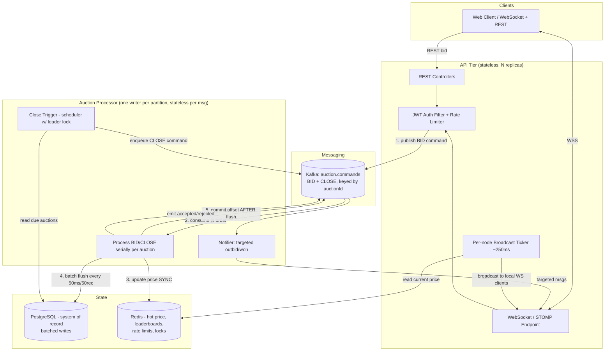
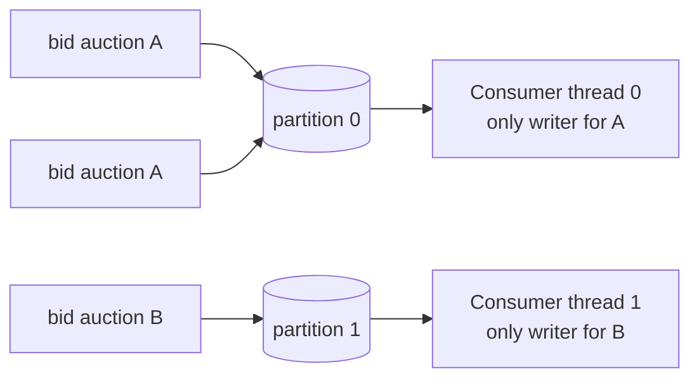
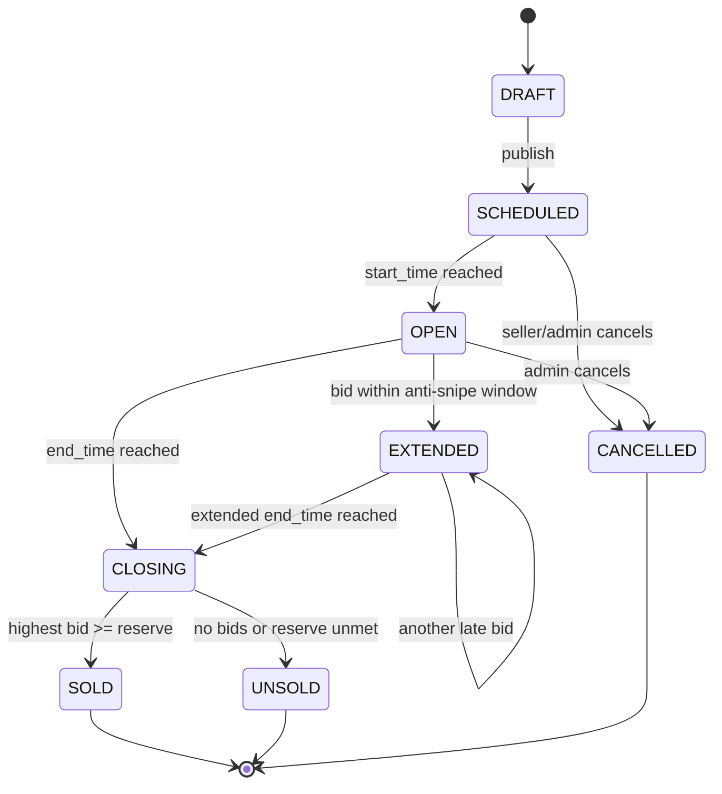

# Project Design Requirements (PDR) — Real-Time Auction Platform

| Field | Value |
|---|---|
| **Project name** | BidStream — Real-Time Auction Platform |
| **Document type** | Project Design Requirements / Technical Design Document |
| **Version** | 1.4 |
| **Status** | Draft for build — API surface extended to close v1.3's audited gaps |
| **Target stack** | Java 21 (LTS), Spring Boot 3.x, Apache Kafka, PostgreSQL, Redis, Docker |
| **Deployment target** | Docker Compose (local/dev), Kubernetes-ready (production) |

> **Note on versions:** Version numbers in this document reflect stable, widely-used releases. Before you start, pin exact versions and verify the latest patch/LTS release of each dependency, since these move over time.

### Revision history

| Version | Changes |
|---|---|
| 1.0 | Initial design. |
| 1.1 | **Architectural corrections.** (1) Reconciled source of truth — this is event-*driven*, not event-*sourced*; Postgres is the system of record, Kafka is the durable ingestion log + result-event stream. (2) Split the bid-latency NFR into *edge-ack* vs *decision* latency; bids are async (202 + WebSocket result), never a synchronous reply over Kafka. (3) Auction close is now a **command routed onto the auction's own partition**, ordered against every bid by the single per-auction consumer (kills clock-skew / double-close). (4) Made the single-hot-auction throughput ceiling explicit and dropped the unmeasured 5k/sec headline. (5) Bid processor is **stateless per message** — it reloads current state each time, so partition reassignment needs no in-memory rebuild. |
| 1.2 | **Operational hardening for load.** (6) **Tick-based broadcaster** — price fan-out decoupled from bid rate; a per-node ticker reads Redis every ~250ms and broadcasts the latest. (7) **Write-behind DB batching** with the strict rule that Kafka offsets commit *only after* the batch is durably flushed to Postgres. (8) **Server-authoritative time** — client clocks are cosmetic; countdowns run against a server clock-offset estimate. (9) Idempotency-key TTL clarified (Redis fast path vs durable unique constraint). (10) Bid history **time-partitioned** for archival. |
| 1.3 | **Failover correctness — the handoff, mechanized.** The v1.2 "stateless per message → replay is free" claim was unsafe. Five coupled defects fixed: (a) dedup was decided by *auction state* (`ALREADY_HIGHEST`) not *event identity*, so a replayed accepted bid could be re-emitted as REJECTED — now gated by an **`event_id`** ledger; (b) the bid unique key included `created_at DEFAULT now()`, so a replay got a fresh timestamp and slipped through — `created_at` now carries the command's **`occurredAt`**, making the guard replay-stable; (c) decisions read Redis, which can be **ahead of Postgres** after a crash → phantom price — the processor now decides from a **working set seeded from committed Postgres**, never Redis; (d) once (b) works, a replayed batch would abort the flush on conflict — all durable inserts are now **`ON CONFLICT DO NOTHING`**; (e) the decision event was produced *after* the transaction and could be lost — it is now an **outbox row inside the flush transaction**. Plus **per-partition** buffers/offsets, and the "stateless per message" language retired in favour of **"bounded, replayable working set."** Two tightenings added beyond the review: working-set entries with un-flushed deltas are **pinned against eviction**, and the ledger dedup DB check is **bounded to the post-rebalance replay window**. |
| 1.4 | **API-surface completeness — the thin parts, specified.** §9/§10/§19 were audited and revised three times over; §14's plain CRUD surface never was, and a strict PDR-vs-built review surfaced the cost: `GET /me/watching` (§14.1) named an endpoint with no domain model, no schema, and no way to ever start "watching" anything behind it; FR-3's "search" was never carried into an API param or a data-model decision; the `categories` table (§8) had no endpoint reading it at all. Fixed by extending the spec, not by letting the build quietly improvise past it: (1) a new **`Watch`** entity + `watches` table (§7.1, §8.4) makes `GET /me/watching` buildable, modeled explicitly as a **durable bookmark decoupled from live WebSocket delivery** (§14.4) so the two are never conflated; (2) a new **`Category`** entity + `GET /categories` (§7.1, §14.4), admin-curated rather than seller-created, so the taxonomy `categoryId` already assumed can actually be discovered; (3) **basic search** (§8.4, §14.4) specified as Postgres `tsvector` + GIN full-text *filtering* — deliberately not ranking, staying inside the boundary §2.2 already drew around relevance engines. None of the three touch §9's concurrency machinery — each is a plain CRUD/read path outside the single-writer Kafka pipeline, and §14.4 states why explicitly rather than leaving it for the next reader to wonder about. (4) Gating category creation on `ROLE_ADMIN` surfaced the same class of gap one level down — the role was named in §17's AuthZ table since the original PDR with no account ever able to hold it. §17.1 closes that with a configured bootstrap-username mechanism, the same shape as JWT key provisioning. |

### The coherent operational story (read this first)

Everything below hangs off one ordered pipeline. Keep it in mind and the rest of the document follows:

> A bid is ingested to **Kafka** first (durable, ordered per auction). The **single per-auction consumer** decides it against a **working set seeded from committed Postgres** (never from Redis), *projects* the new price to **Redis synchronously** for reads/broadcast, and appends its durable writes — the `bids` row, the `auctions` upsert, an **`event_id` dedup-ledger row**, and **outbox rows for the client's result + lifecycle events** — to a **per-partition batch**. It commits its **Kafka offset only after that batch is flushed to Postgres in one transaction**. Every durable insert is **idempotent (`ON CONFLICT DO NOTHING`)** and keyed by the command's own **`occurredAt`**, so a redelivered command after a partition reassignment **replays its stored outcome** rather than being re-decided — no lost bid, no contradictory reject, no phantom price. A separate **ticker reads Redis on a fixed interval** and broadcasts the current price to each node's own WebSocket clients. Auction **close is just another command on the auction's partition**, so "did this bid beat the close?" is a trivial ordering question on one log. **Postgres is the system of record; Kafka is the log; Redis is the fast, rebuildable *projection*.** The processor is not stateless — it holds a **bounded, replayable working set** (≤ one flush-window of deltas, all sitting after the last committed offset).

---

## 1. Executive Summary

BidStream is a horizontally-scalable, **event-driven** auction platform where multiple users bid on items in real time. Bidders see prices update within a fraction of a second, the system guarantees that concurrent bids are resolved deterministically (exactly one winner, no lost bids), and every committed bid is durably recorded in an immutable, auditable history.

The architecture is built around four ideas:

1. **Event-driven bidding on a durable Kafka log** — every bid is ingested to Kafka before it is processed. Kafka is the durable **ingestion log and result-event stream**, not the system of record: it decouples ingestion from processing, absorbs bursts, orders bids per auction, and lets new consumers (notifications, analytics, fraud detection) be added without touching core logic. *(This is event-driven, not event-sourced — auction state is not rebuilt by replaying the bid log; it lives in Postgres. See §9.1.)*
2. **Per-auction serialized processing** — all events for one auction (bids **and the close**) are keyed to a single Kafka partition and handled by a single writer at a time. This turns a hard distributed-concurrency problem into a simple single-threaded state machine *per auction*, while allowing full parallelism *across* auctions.
3. **Clear source of truth** — **PostgreSQL is the system of record** for committed state, history, and settlement. **Redis** is the low-latency, fully-rebuildable read + coordination layer (current price, leaderboards, rate limits, broadcast fan-out). A bid is *accepted-for-processing* the moment it is durably in Kafka, and *committed* the moment its row is flushed to Postgres.
4. **Load-decoupled I/O** — the hot path never lets one expensive resource gate another: Redis is written synchronously per bid, Postgres is written in **batches**, Kafka offsets commit **only after** those batches are durable, and client broadcasts are driven by a **fixed-interval ticker** rather than by individual bids.

**The honestly-hard case, stated up front:** the interesting moment in any auction is thousands of people hammering *one* item in the final seconds. Single-partition-per-auction deliberately **serializes exactly that** to one consumer. This is a chosen tradeoff — *correctness and ordering over single-auction write throughput* — and it is the right one for auctions, where a single item does not need millions of writes per second. Aggregate throughput across many auctions scales horizontally; per-auction throughput is intentionally bounded (see §20).

This PDR specifies the full system: requirements, architecture, domain model, data schemas, API and event contracts, the concurrency model, resilience and failure handling, security, observability, deployment, testing, and a phased build roadmap.

---

## 2. Goals and Non-Goals

### 2.1 Goals

- Real-time bidding with sub-second price propagation to all watchers of an auction.
- Correctness under concurrency: no lost bids, no double-wins, deterministic tie-breaking.
- Durable, auditable bid history (immutable event log).
- Automatic (proxy) bidding — users set a maximum and the system bids on their behalf.
- Time-based auction closing with anti-sniping extension.
- Horizontal scalability of the stateless application tier.
- Production concerns first-class: observability, security, graceful degradation, testability.

### 2.2 Non-Goals (v1)

- Payment processing / real money movement (settlement is modeled but stubbed; integrate a PSP later).
- Full identity/KYC, disputes, or escrow flows.
- Recommendation/search relevance engines (basic listing/filtering only — §14.4 specifies exactly where that line sits: keyword *filtering* via Postgres full-text search, no relevance ranking, no typo tolerance beyond what `tsvector` gives for free).
- Mobile native apps (the platform is API + WebSocket first; clients are out of scope).
- Multi-region active-active replication (single-region HA is the v1 target).

---

## 3. Functional Requirements

| ID | Requirement |
|---|---|
| FR-1 | Users can register, authenticate, and manage a profile. |
| FR-2 | Sellers can create an auction item with title, description, category, starting price, optional reserve price, start time, and end time. |
| FR-3 | Buyers can browse/list/filter/search auctions (basic keyword search, §14.4) and view a single auction with live current price. |
| FR-4 | Buyers can place a bid on an OPEN auction. A valid bid must exceed `current_price + min_increment` and not be placed by the current highest bidder. |
| FR-5 | Buyers can set an auto-bid (proxy) maximum; the system automatically raises their bid up to that maximum to keep them the highest bidder. |
| FR-6 | All watchers of an auction receive real-time updates (new price, new high bidder, outbid notices, time-extended, auction-ended). |
| FR-7 | A bidder who is outbid receives a targeted "you've been outbid" notification. |
| FR-8 | Auctions close automatically at end time. If a bid lands within the anti-snipe window, the end time extends. |
| FR-9 | On close, the winner is the highest bidder ≥ reserve. If reserve unmet, the auction ends UNSOLD. |
| FR-10 | Full, immutable bid history per auction is queryable. |
| FR-11 | Users cannot bid on their own auctions. |
| FR-12 | Idempotent bid submission: a client retry with the same idempotency key must not create a duplicate bid. |
| FR-13 | Buyers can watch/unwatch an auction; a persisted watchlist (`GET /me/watching`) survives across sessions and devices, independent of any live WebSocket subscription (§7.1, §8.4, §14.4). |

---

## 4. Non-Functional Requirements

| Category | Target |
|---|---|
| **Edge-ack latency** | p99 < 20 ms from bid submission to `202 Accepted` (validate + rate-limit + publish to Kafka). This is the synchronous client round-trip. |
| **Decision latency** | p99 < 200 ms from submission to the accept/reject *decision event* delivered to the bidder over WebSocket. This spans Kafka + serialized processing and is intentionally asynchronous — there is **no synchronous request/reply over Kafka**. |
| **Broadcast latency** | Price updates are delivered on a fixed **broadcast tick** (default 250 ms; see §15). A watcher sees the current price within one tick + delivery time; the close triggers an immediate final push. |
| **Throughput (per auction)** | Bounded by design — one partition, one writer. Target and *measure* a realistic figure (e.g. a few hundred bids/sec on a single hot auction) rather than assert it. |
| **Throughput (aggregate)** | Scales horizontally with partitions × consumer replicas. State the number you have actually load-tested, not an aspirational one. |
| **Availability** | 99.9% for the API/WebSocket tier. |
| **Durability** | Zero *committed*-bid loss. Kafka `acks=all`, `min.insync.replicas ≥ 2`; Kafka offset is committed **only after** the bid is durably flushed to Postgres (§9.6); result events use the transactional outbox. |
| **Consistency** | Strong ordering & correctness *per auction* (bids and close on one partition, one writer); eventual consistency for cross-auction read models and Redis-backed views. |
| **Scalability** | Stateless app + processing tiers scale horizontally; per-auction throughput is a deliberate ceiling, auctions scale out. |
| **Recoverability** | Rebuildable read state; RTO < 15 min, RPO ≈ 0 for committed bids. |
| **Security** | TLS everywhere, JWT auth, rate limiting, least-privilege DB/broker credentials. |

---

## 5. High-Level Architecture

The system separates the **write path** (commands in) from the **read/notify path** (updates out). Bids *and the close* flow into one Kafka command log per auction, are processed serially per auction, batched to Postgres, and reflected in Redis — from which a fixed-interval ticker broadcasts to clients.



### 5.1 Why this shape

- **The API tier is stateless.** Any replica serves any REST call or holds any WebSocket connection. Scaling = add replicas behind a load balancer.
- **Kafka is the spine and the ordering authority.** One command log per auction (`auction.commands`) decouples ingest from processing, absorbs bursts, and orders **bids and the close together** so sniping and settlement are trivial ordering questions (§10.1, §11.3).
- **One stateless writer per auction.** All contention collapses to a single logical writer; it holds no state between messages, so failover is just "start reading" (§9.1, §19).
- **The hot path never gates on the slow resource.** Redis is written synchronously per bid; Postgres is written in batches; the Kafka offset commits only *after* the batch is durable (§9.6). Correctness is preserved without paying per-bid Postgres latency.
- **Broadcast is a ticker, not a firehose.** Clients get price updates from a fixed-interval read of Redis per node (§15.3), so 50k watchers × 50 bids/sec does not become millions of messages/sec.
- **Postgres is the truth.** If Redis is wiped, it rebuilds from Postgres. If a read model is corrupted, it replays from Kafka.

---

## 6. Technology Stack & Justification

| Concern | Choice | Why |
|---|---|---|
| Language/runtime | **Java 21 (LTS)** | Virtual threads (Project Loom) for cheap concurrency, records, pattern matching, mature ecosystem. |
| Framework | **Spring Boot 3.x** | Batteries-included: web, WebSocket/STOMP, Kafka, Data JPA, Security, Actuator. |
| Messaging | **Apache Kafka (KRaft mode, no ZooKeeper)** | Durable, ordered-per-partition event log; natural fit for bids-as-events. |
| Relational DB | **PostgreSQL 16+** | ACID system of record, strong constraints, JSONB, `SELECT ... FOR UPDATE`, advisory locks. |
| Cache/coordination | **Redis 7+** | Sub-ms reads, atomic ops + Lua scripts, pub/sub, sorted sets (leaderboards), TTL. |
| API style | **REST (JSON)** + **WebSocket (STOMP)** | REST for CRUD/queries; WebSocket for live push. |
| Migrations | **Flyway** | Versioned, repeatable, reviewable schema changes. |
| Build | **Gradle** (or Maven) | Dependency mgmt, multi-module support. |
| Testing | **JUnit 5, Mockito, Testcontainers, Gatling/k6** | Unit → integration (real Kafka/PG/Redis in containers) → load. |
| Observability | **Micrometer + Prometheus + Grafana, OpenTelemetry** | Metrics, dashboards, distributed tracing. |
| Containerization | **Docker + Docker Compose** | Reproducible local stack; K8s-ready images for prod. |

---

## 7. Domain Model (OOP Design)

The domain is modeled with a clear separation between **entities** (identity + lifecycle), **value objects** (immutable, no identity), **aggregates** (consistency boundaries), and **domain services** (logic that spans entities). The `Auction` aggregate is the consistency boundary — all bid mutations go through it.

### 7.1 Core entities & value objects

```
User (entity)
 ├─ id: UUID
 ├─ username, email
 ├─ passwordHash
 ├─ roles: Set<Role>
 └─ createdAt

Money (value object, immutable)
 ├─ amount: BigDecimal        // never use double/float for money
 └─ currency: Currency

AuctionItem  ── the Auction aggregate root (entity)
 ├─ id: UUID
 ├─ sellerId: UUID
 ├─ title, description, categoryId
 ├─ startingPrice: Money
 ├─ reservePrice: Money (nullable)
 ├─ currentPrice: Money
 ├─ currentWinnerId: UUID (nullable)
 ├─ minIncrement: Money
 ├─ status: AuctionStatus       // state machine, see §11
 ├─ startTime, endTime: Instant
 ├─ version: long               // optimistic lock
 └─ methods: placeBid(), extendIfSniping(), close(), settle()

Bid (entity, immutable once written)
 ├─ id: UUID
 ├─ auctionId: UUID
 ├─ bidderId: UUID
 ├─ amount: Money
 ├─ type: MANUAL | AUTO
 ├─ status: ACCEPTED | REJECTED | OUTBID | WINNING
 ├─ idempotencyKey: String
 └─ createdAt: Instant

AutoBid / ProxyBid (entity)
 ├─ id: UUID
 ├─ auctionId, bidderId: UUID
 ├─ maxAmount: Money
 ├─ active: boolean
 └─ createdAt: Instant

Watch (entity)  ── a durable bookmark, not a live-delivery mechanism (§14.4)
 ├─ userId: UUID
 ├─ auctionId: UUID
 └─ createdAt: Instant

Category (entity)  ── a curated, admin-managed taxonomy (§14.4); not part of the Auction
 │                     aggregate — an AuctionItem merely references categoryId
 ├─ id: UUID
 ├─ name: String
 └─ slug: String
```

### 7.2 Enumerations

```
AuctionStatus  : DRAFT, SCHEDULED, OPEN, EXTENDED, CLOSING, SOLD, UNSOLD, CANCELLED
BidStatus      : ACCEPTED, REJECTED, OUTBID, WINNING
BidType        : MANUAL, AUTO
BidRejectReason: AUCTION_NOT_OPEN, BELOW_MIN_INCREMENT, SELF_BID,
                 ALREADY_HIGHEST, AUCTION_ENDED, STALE_VERSION, RATE_LIMITED
```

### 7.3 Layering (Hexagonal / Ports & Adapters)

```
domain/            <- pure business logic, no framework imports
  model/           <- entities, value objects, enums
  service/         <- BiddingService, AutoBidResolver, AuctionLifecycleService
  port/            <- interfaces: AuctionRepository, EventPublisher, PriceCache
application/       <- use-case orchestrators (PlaceBidUseCase, CreateAuctionUseCase)
adapter/
  in/
    rest/          <- controllers, request/response DTOs
    ws/            <- STOMP handlers
    kafka/         <- consumers
  out/
    persistence/   <- JPA repositories implementing domain ports
    cache/         <- Redis adapters implementing PriceCache
    messaging/     <- Kafka producers implementing EventPublisher
config/            <- Spring config, security, beans
```

**Design principles applied:** the domain depends on nothing (dependency inversion); adapters depend on the domain via ports (interface segregation); `Money` and event objects are immutable value objects; the `AuctionItem` aggregate encapsulates its invariants so no adapter can put it in an invalid state.

### 7.4 Key domain method — `AuctionItem.placeBid`

Pseudocode for the invariant-enforcing core (executed inside the single-writer processor):

```
Result placeBid(bidderId, amount, now):
    if status not in {OPEN, EXTENDED}      -> reject(AUCTION_NOT_OPEN)
    if now >= endTime                      -> reject(AUCTION_ENDED)
    if bidderId == sellerId                -> reject(SELF_BID)
    if bidderId == currentWinnerId         -> reject(ALREADY_HIGHEST)
    if amount < currentPrice + minIncrement-> reject(BELOW_MIN_INCREMENT)

    // apply
    previousWinner = currentWinnerId
    currentPrice   = amount
    currentWinnerId= bidderId
    version        = version + 1
    maybeExtendForSniping(now)             // §11.2
    return accepted(previousWinner)
```

---

## 8. Data Model — PostgreSQL

PostgreSQL is the durable source of truth. All monetary columns use `NUMERIC(19,4)` (never floating point). All IDs are UUIDs. Timestamps are `TIMESTAMPTZ` (UTC).

**One rule underpins failover correctness (read this first).** Every durable column that participates in a **dedup key** is keyed by data carried *in the event itself* — never by `now()`. The command's `occurredAt` is stamped once, at the edge, and travels with it through Kafka; a replay re-inserts with the **same** `occurredAt`, so the idempotency guards fire on replay exactly as they did the first time. `DEFAULT now()` is therefore **banned** from any column in a dedup key (this is the fix for the v1.2 bug where `bids.created_at DEFAULT now()` silently defeated the unique constraint on replay).

```sql
-- USERS
CREATE TABLE users (
    id            UUID PRIMARY KEY DEFAULT gen_random_uuid(),
    username      VARCHAR(50)  NOT NULL UNIQUE,
    email         VARCHAR(255) NOT NULL UNIQUE,
    password_hash VARCHAR(255) NOT NULL,
    roles         TEXT[]       NOT NULL DEFAULT ARRAY['ROLE_USER'],
    created_at    TIMESTAMPTZ  NOT NULL DEFAULT now()
);

-- CATEGORIES
CREATE TABLE categories (
    id    UUID PRIMARY KEY DEFAULT gen_random_uuid(),
    name  VARCHAR(100) NOT NULL UNIQUE,
    slug  VARCHAR(120) NOT NULL UNIQUE
);

-- AUCTION ITEMS (aggregate root)
CREATE TABLE auctions (
    id                UUID PRIMARY KEY DEFAULT gen_random_uuid(),
    seller_id         UUID NOT NULL REFERENCES users(id),
    category_id       UUID REFERENCES categories(id),
    title             VARCHAR(200) NOT NULL,
    description       TEXT,
    starting_price    NUMERIC(19,4) NOT NULL CHECK (starting_price >= 0),
    reserve_price     NUMERIC(19,4) CHECK (reserve_price >= starting_price),
    min_increment     NUMERIC(19,4) NOT NULL DEFAULT 1.00 CHECK (min_increment > 0),
    current_price     NUMERIC(19,4) NOT NULL,
    current_winner_id UUID REFERENCES users(id),
    currency          CHAR(3) NOT NULL DEFAULT 'USD',
    status            VARCHAR(20) NOT NULL DEFAULT 'SCHEDULED',
    start_time        TIMESTAMPTZ NOT NULL,
    end_time          TIMESTAMPTZ NOT NULL,
    anti_snipe_seconds INT NOT NULL DEFAULT 30,
    version           BIGINT NOT NULL DEFAULT 0,   -- optimistic lock
    created_at        TIMESTAMPTZ NOT NULL DEFAULT now(),
    CHECK (end_time > start_time)
);
CREATE INDEX idx_auctions_status_end   ON auctions(status, end_time);
CREATE INDEX idx_auctions_category      ON auctions(category_id);
CREATE INDEX idx_auctions_seller        ON auctions(seller_id);

-- BIDS (append-only history of ACCEPTED bids only) — TIME-PARTITIONED for archival (§8.3)
-- CHANGE vs v1.2: created_at is the event's occurredAt (supplied by the app at the edge),
--                 NOT DEFAULT now(). This is what makes the idempotency guard survive a
--                 Kafka replay: a redelivered command carries the SAME occurredAt, so it
--                 re-inserts the identical tuple and is rejected here.
CREATE TABLE bids (
    id              UUID NOT NULL DEFAULT gen_random_uuid(),
    auction_id      UUID NOT NULL REFERENCES auctions(id),
    bidder_id       UUID NOT NULL REFERENCES users(id),
    amount          NUMERIC(19,4) NOT NULL,
    type            VARCHAR(10) NOT NULL DEFAULT 'MANUAL',
    status          VARCHAR(10) NOT NULL,   -- ACCEPTED | OUTBID | WINNING (rejects live in processed_events)
    idempotency_key VARCHAR(80) NOT NULL,
    -- Single timestamp: the command's occurredAt, stamped at the edge and carried through
    -- Kafka. NO DEFAULT now() — that is what makes the guard survive replay. Also the
    -- partition column, so the PK/UNIQUE key can (and must) include it.
    created_at      TIMESTAMPTZ NOT NULL,   -- = command.occurredAt (app-supplied, never now())
    PRIMARY KEY (id, created_at),
    UNIQUE (auction_id, bidder_id, idempotency_key, created_at)  -- durable, replay-stable idempotency guard
) PARTITION BY RANGE (created_at);

-- One partition per month; created ahead of time by a maintenance job (pg_partman or cron).
CREATE TABLE bids_2026_08 PARTITION OF bids
    FOR VALUES FROM ('2026-08-01') TO ('2026-09-01');
CREATE TABLE bids_2026_09 PARTITION OF bids
    FOR VALUES FROM ('2026-09-01') TO ('2026-10-01');
-- ... and so on.

CREATE INDEX idx_bids_auction_time ON bids(auction_id, created_at DESC);
CREATE INDEX idx_bids_bidder       ON bids(bidder_id);

-- AUTO / PROXY BIDS
CREATE TABLE auto_bids (
    id         UUID PRIMARY KEY DEFAULT gen_random_uuid(),
    auction_id UUID NOT NULL REFERENCES auctions(id),
    bidder_id  UUID NOT NULL REFERENCES users(id),
    max_amount NUMERIC(19,4) NOT NULL,
    active     BOOLEAN NOT NULL DEFAULT true,
    created_at TIMESTAMPTZ NOT NULL DEFAULT now(),
    UNIQUE (auction_id, bidder_id)
);
CREATE INDEX idx_autobids_auction_active ON auto_bids(auction_id) WHERE active;

-- TRANSACTIONAL OUTBOX (reliable event publishing, §10.3)
CREATE TABLE outbox (
    id            BIGSERIAL PRIMARY KEY,
    aggregate_id  UUID NOT NULL,
    topic         VARCHAR(100) NOT NULL,
    partition_key VARCHAR(80)  NOT NULL,
    payload       JSONB NOT NULL,
    created_at    TIMESTAMPTZ NOT NULL DEFAULT now(),
    published_at  TIMESTAMPTZ
);
CREATE INDEX idx_outbox_unpublished ON outbox(created_at) WHERE published_at IS NULL;

-- SETTLEMENTS (winner record; payment stubbed in v1)
CREATE TABLE settlements (
    id           UUID PRIMARY KEY DEFAULT gen_random_uuid(),
    auction_id   UUID NOT NULL UNIQUE REFERENCES auctions(id),
    winner_id    UUID REFERENCES users(id),
    final_price  NUMERIC(19,4),
    outcome      VARCHAR(10) NOT NULL,     -- SOLD | UNSOLD
    settled_at   TIMESTAMPTZ NOT NULL DEFAULT now()
);

-- PROCESSED EVENTS (dedup ledger + stored outcome) — NEW in v1.3
-- One row per command the auction-processor has durably handled (BID accepted OR rejected,
-- and CLOSE). This is the authority for "have I already processed event E?". It is written
-- INSIDE the flush transaction (§9.6), so its presence is atomic with the bid/auction/outbox
-- writes it accompanies. On replay, its presence makes the processor REPLAY the stored
-- outcome instead of re-deciding from current state (which is what caused the v1.2
-- contradictory-reject bug).
CREATE TABLE processed_events (
    event_id      UUID PRIMARY KEY,          -- command.eventId — the dedup key
    auction_id    UUID NOT NULL,
    outcome       VARCHAR(16) NOT NULL,      -- ACCEPTED | REJECTED | EXTENDED | SOLD | UNSOLD
    reject_reason VARCHAR(24),               -- nullable; populated on REJECTED
    final_price   NUMERIC(19,4),             -- price/winner snapshot, so replay can re-assert Redis
    winner_id     UUID,                      -- without a re-decision
    occurred_at   TIMESTAMPTZ NOT NULL,      -- = command.occurredAt (used for pruning)
    processed_at  TIMESTAMPTZ NOT NULL DEFAULT now()  -- bookkeeping only, NOT a dedup key
);
CREATE INDEX idx_processed_events_occurred ON processed_events(occurred_at);
```

### 8.2 Concurrency-relevant schema notes

- `auctions.version` powers **optimistic locking** as a defence-in-depth backstop; primary safety is the single-writer-per-partition model (§9).
- `bids` holds **only ACCEPTED bids** and is append-only; the current winner is derived state cached on `auctions` and in Redis. History is never mutated. **Processor-level rejections are not written to `bids`** — they are recorded in `processed_events` (`outcome = REJECTED`, with a `reject_reason`) so a replay reproduces the same rejection without re-deciding, and the immutable bid history isn't polluted with non-bids.
- **Two independent idempotency guards, covering different crash windows (§19):** `processed_events.event_id` is the **event-identity** authority (answers "have I processed command E?"); `bids`'s `UNIQUE(auction_id, bidder_id, idempotency_key, created_at)` is the **bid-identity** guard (answers "is this the same logical bid?"). Both are needed — the first prevents contradictory re-decisions, the second catches a duplicate that slips past.
- The bid unique guard is **replay-stable** because `created_at` carries the command's `occurredAt`, stamped once at the edge (never `now()`). This is the fix for the v1.2 defect where `DEFAULT now()` gave replays a fresh timestamp and silently defeated the constraint.
- The `outbox` table enables the **transactional outbox** (§10.3): the bid write, the `auctions` state change, the `processed_events` row, **and the decision + lifecycle events** all commit in the **same** Postgres transaction — eliminating every dual-write hole, including "result lost between flush and produce."

### 8.3 Data archival — partitioning the immutable log

`bids` is **range-partitioned by `created_at`** (monthly) because an append-only history grows without bound and archival deletes would otherwise lock a hot table:

- A maintenance job (`pg_partman` or a scheduled task) **pre-creates** next month's partition before it's needed.
- Old months are **detached and archived** with `ALTER TABLE ... DETACH PARTITION`, which does **not** lock the active partition.
- Because live bidding only inserts into the *current* partition, this pairs cleanly with per-partition batching (§9.6): every flush targets one hot partition.
- **The v1.2 month-boundary retry worry disappears.** A replay carries the original `occurred_at`, so it always targets the *same* partition the original insert did — there is no "straddling" case.
- **Detach age must exceed Kafka retention.** `auction.commands` is retained 7 days (§10.1), so a command can only replay within that window. Detaching partitions on a monthly horizon (≫ 7 days) guarantees any replayed command's `occurred_at` still lands in a **live** partition, so the idempotent re-insert never fails for want of a partition.
- **`processed_events` is pruned, not partitioned.** A scheduled `DELETE FROM processed_events WHERE occurred_at < now() - INTERVAL '8 days'` (comfortably past Kafka's 7-day retention) keeps it bounded to roughly one retention window regardless of total bid volume: beyond that horizon a command can no longer be replayed, so its ledger row has no dedup value. PK lookups on `event_id` stay O(1); pruning is a cheap indexed range delete.

### 8.4 Schema additions for the previously-thin API surface (v1.4)

These back the endpoints in §14.4. **None of them participate in the bid-processing replay path
(§9.6), so none of them are subject to the "no `DEFAULT now()` in a dedup key" rule** — that rule
exists specifically because Kafka can redeliver a *bid* command and the guard has to survive that
replay identically each time. Nothing here is ever replayed off a Kafka log; an ordinary
`DEFAULT now()` is exactly right for all of it.

```sql
-- WATCHES — a durable bookmark. Idempotent by construction: watching twice writes the same row
-- (PK conflict → ON CONFLICT DO NOTHING), unwatching something never-watched deletes zero rows.
-- Neither is an error (§14.4) — both are legitimate outcomes of a client that doesn't track
-- local watch-state precisely and just calls the endpoint to be sure.
CREATE TABLE watches (
    user_id     UUID NOT NULL REFERENCES users(id),
    auction_id  UUID NOT NULL REFERENCES auctions(id),
    created_at  TIMESTAMPTZ NOT NULL DEFAULT now(),
    PRIMARY KEY (user_id, auction_id)
);
CREATE INDEX idx_watches_auction ON watches(auction_id);

-- CATEGORIES already exist (§8, migration V1) as a bare id/name/slug table. No schema change
-- needed here — the gap was purely that §14.1 never specified an endpoint reading it (§14.4 adds
-- one).

-- BASIC SEARCH — Postgres full-text search, GENERATED so it can never drift from title/description
-- (no separate write path to keep in sync, no reindex job).
ALTER TABLE auctions ADD COLUMN search_vector tsvector
    GENERATED ALWAYS AS (
        to_tsvector('english', coalesce(title, '') || ' ' || coalesce(description, ''))
    ) STORED;
CREATE INDEX idx_auctions_search ON auctions USING GIN (search_vector);
```

**Why `tsvector` + GIN, not `LIKE '%term%'`.** A leading-wildcard `LIKE`/`ILIKE` cannot use a
standard B-tree index — every search becomes a full sequential scan the moment the catalog grows
past a trivial size, which is exactly the kind of query that looks fine in a demo and falls over
in production. `tsvector` + GIN gives real indexed lookup for the basic keyword filter FR-3 asks
for, without building the relevance-ranking machinery §2.2 explicitly excludes: there is no
`ts_rank`, no boosting, no synonym handling here — just "does this row's title/description contain
the query's words," filtered, not scored. **If a future need calls for typo-tolerant substring
matching** (a user typing "auciton"), `pg_trgm` + a trigram GIN index is the documented upgrade
path — deliberately not built now, because FR-3 never asked for it and nothing in this codebase's
own testing has demonstrated a need for it yet (the same "quote only measured numbers, don't build
ahead of evidence" discipline §20/§22 already apply to throughput applies here to query capability).

---

## 9. Concurrency & Threading Design (the hard part)

This is the heart of a "production-ready" auction system. The requirement: when many users bid on the same item at nearly the same instant, exactly one becomes the highest bidder, no accepted bid is lost, and the outcome is deterministic and explainable.

### 9.1 Primary strategy — single-writer-per-auction via Kafka partitioning

All `auction.commands` events (both `BID` and `CLOSE`) are **keyed by `auctionId`**. Kafka guarantees that all records with the same key land in the same partition, and each partition is consumed by exactly one consumer instance in the consumer group. Therefore:

- Every bid for a given auction is processed **serially, in order, by one thread.**
- There is **no lock contention** for a single auction because there is only one writer.
- Different auctions live on different partitions and are processed **fully in parallel** across the consumer group.

**The close is on the same partition too.** Auction closing is *not* a side channel on a different topic/consumer — it is a `CLOSE` command keyed by the same `auctionId`, landing on the same partition, consumed by the same single writer (§11.3). This is the load-bearing decision that kills the sniping race: "did this last-millisecond bid beat the close?" becomes a trivial ordering question on **one log read by one consumer**, with no cross-node clock comparison and no possibility of two nodes double-closing. Anti-snipe extension (§11.2) is applied by that same writer, so extension and close share one timeline.

**The processor holds a bounded, replayable working set (not truly stateless).** Rather than reloading from Redis (which can drift ahead of the truth after a crash — the phantom-price trap), the consumer decides from a small LRU working set seeded from **committed** Postgres, carrying at most one flush-window of un-flushed deltas that all sit **after** the last committed Kafka offset (§9.6). This is what makes failover cheap and *correct*: when a partition is reassigned, the new owner seeds each touched auction from committed Postgres and **replays** the messages after the last committed offset — deterministically rebuilding both the working set and the Redis projection, with nothing recovered from the JVM heap. (See §9.6 for the mechanism and §19 for the full failover story.)

This converts a nasty distributed-locking problem into a simple single-threaded state machine per auction. Parallelism scales with partition count and consumer replicas.



### 9.2 Backstop strategy — optimistic locking

Even with serialized processing, defense in depth matters (rebalances, redeploys, a stray writer). Each update uses the `version` column:

```sql
UPDATE auctions
   SET current_price = :amount, current_winner_id = :bidder,
       version = version + 1, end_time = :maybeExtendedEnd
 WHERE id = :auctionId AND version = :expectedVersion;
-- 0 rows updated  => someone else moved first => reprocess/reject
```

If the update affects zero rows, the processor re-reads state and re-evaluates the bid rather than blindly overwriting.

### 9.3 Fast-path pre-validation with Redis (atomic)

Before a bid is even published to Kafka, the edge does a cheap rejection using the cached current price to shed obviously-invalid load (e.g., a bid below the current price). This is a *hint*, not the source of truth — the authoritative check is in the serialized processor. A Redis Lua script makes the read-and-compare atomic:

```lua
-- KEYS[1] = auction:{id}:current   ARGV[1] = bidAmount
local price = tonumber(redis.call('HGET', KEYS[1], 'price'))
local incr  = tonumber(redis.call('HGET', KEYS[1], 'minIncrement'))
if price == nil then return -1 end                 -- unknown, let server decide
if tonumber(ARGV[1]) < price + incr then return 0 end  -- fast reject
return 1                                            -- plausibly valid, proceed
```

### 9.4 Thread model inside the app

- **WebSocket/REST ingestion**: served on Java 21 **virtual threads** — thousands of concurrent connections without a thread-per-request cost.
- **Bid processor**: a Kafka listener container with concurrency = number of assigned partitions. Each partition's records are handled by a single thread; the working set is per-thread and per-partition (§9.6), so **no shared mutable auction state crosses threads.**
- **Broadcast**: *not* per-bid. A single scheduled **ticker thread** per node reads current auction prices from Redis on a fixed interval and pushes to that node's WebSocket sessions (§15.3). This deliberately decouples broadcast volume from bid volume.
- **Shared collections** (e.g., session registries) use `ConcurrentHashMap`; counters use `LongAdder`/atomics; never `synchronized` on the hot path.

### 9.5 Distributed locks — when (and when not) to use

With partition-based serialization you **do not need** distributed locks for bid correctness, and (post-§11.3) you don't need them for closing correctness either, since the close is ordered on the auction's own partition. Reserve a Redis lock (`SET key val NX PX ttl`, released via a compare-and-delete Lua script — the Redlock idea) only for the **close *trigger*** — i.e. ensuring a single scheduler instance is the one scanning for due auctions and emitting `CLOSE` commands, so the same close isn't enqueued by five schedulers at once. Even without the lock, idempotent close handling (§11.3) makes a duplicate `CLOSE` harmless; the lock is an efficiency measure, not a correctness one. Always use a TTL so a crashed holder cannot deadlock the system.

### 9.6 Write-behind batching, decoupled from decision state

This section carries the load-bearing failover mechanism. It refines the earlier "stateless per message" phrasing (§9.1, §9.4) into the honest, stronger claim below.

**The problem.** The processor must (a) decide each bid against the *current* price, (b) make accepted bids durable in Postgres without paying per-bid write latency across the fleet, and (c) survive a mid-auction partition reassignment without losing or double-applying a committed bid. A naive "stateless, reload current state from Redis" approach satisfies (a)/(b) but breaks (c): between flushes, Redis is the only place holding processed-but-un-flushed decisions, so "reload from Redis" and "Redis can be ahead of the truth after a crash" become the same fact — the phantom-price bug.

**The honest state model (supersedes "stateless per message").** The processor is **not** stateless; it holds a **bounded, fully-reconstructible working set**:

- An **LRU cache of recently-active auctions**, each entry carrying that auction's current price/winner/version/end-time.
- An entry is only ever **committed-Postgres state, or committed-plus-un-flushed-deltas** ahead of it. The un-flushed portion is at most **one flush window** (≤ 50 records / 50 ms).
- Those un-flushed deltas sit **strictly after the last committed Kafka offset** — so they are not "lost state," they are exactly the messages Kafka will redeliver on reassignment.
- An entry with un-flushed deltas is **pinned against eviction** until its batch flushes; otherwise a re-seed from committed Postgres would miss the deltas and mis-decide.

This is the defensible claim: *the processor holds no state that cannot be rebuilt by seeding from committed Postgres and replaying the messages after the last committed offset.* Failover is still "start reading" — the reason is **replayability**, not the absence of state.

**Decisions read the working set, never Redis.** On each command the processor decides from its working set, seeded on first touch (or after eviction) from the **committed** `auctions` row in Postgres — a single indexed PK read, served from shared buffers for a hot auction. It **does not read Redis to decide.** Redis is the processor's *output projection* (for the broadcast ticker and edge fast-path), never its decision input. That is what makes a phantom Redis price harmless: any Redis value Postgres lacks is, by the invariant above, backed by a message that will replay and re-derive it from committed state.

**The pipeline (per message):**

```
onCommand(cmd):                              # cmd carries eventId, occurredAt, idempotencyKey, partition, offset
    # 1. DEDUP on event identity (NOT on auction state)
    if workingSet.seenThisSession(cmd.eventId)
       or redisProcessedCache.get(cmd.eventId)          # best-effort, written POST-commit only
       or processedEvents.contains(cmd.eventId):        # Postgres authority, checked on Redis miss
        replayStoredOutcome(cmd)             # re-assert Redis projection from stored final_price/winner
        markOffsetReadyToCommit(cmd.partition, cmd.offset)   # decision event already durable via outbox
        return

    # 2. DECIDE from working set (seeded from COMMITTED Postgres, never Redis)
    state   = workingSet.getOrSeedFromPostgres(cmd.auctionId)
    outcome = auction.placeBidOrClose(state, cmd, cmd.occurredAt)   # §7.4 / §11.3 / §12

    # 3. Project to Redis synchronously (for ticker + edge hint), mark dirty
    redis.setCurrent(cmd.auctionId, state.price, state.winner, state.endTime)
    redis.sadd("auctions:dirty", cmd.auctionId)

    # 4. Buffer durable writes into THIS PARTITION's batch (all idempotent)
    batch[cmd.partition].add(
        processedEventsRow(cmd.eventId, outcome, occurred_at=cmd.occurredAt, final_price, winner),  # ON CONFLICT DO NOTHING
        (outcome==ACCEPTED ? bidsRow(created_at=cmd.occurredAt) : null),                             # ON CONFLICT DO NOTHING
        auctionsUpsert(state),                                                                        # by PK
        outboxRow(decisionEvent(cmd.correlationId, outcome)),          # the client's accept/reject
        outboxRow(lifecycleEvent(outcome)))                            # accepted/extended/sold/unsold, if any

    # 5. Flush + commit, PER PARTITION, offset AFTER flush
    if batch[cmd.partition].full() or timerElapsed(cmd.partition):
        db.flushOneTransaction(batch[cmd.partition])                  # all rows, ONE txn, ON CONFLICT DO NOTHING
        kafka.commitOffset(cmd.partition, batch[cmd.partition].lastOffset)   # ONLY now
        redisProcessedCache.put(eventIds, ttl≈8d)                     # best-effort, POST-commit
        batch[cmd.partition].clear()                                  # pinned working-set entries may now be evicted
```

**The non-negotiable rules:**

1. **Offset after flush, per partition.** A partition's offset is committed only after that partition's batch is durably flushed. A crash mid-batch leaves the offset un-committed, so those messages replay.
2. **Every durable insert is idempotent.** `processed_events` (`ON CONFLICT (event_id) DO NOTHING`) and `bids` (`ON CONFLICT ON CONSTRAINT ... DO NOTHING`) both tolerate a replayed batch re-inserting already-persisted rows, so a redelivered batch **commits cleanly instead of aborting** on the first conflict. This is the fix for the poison-transaction that otherwise appears the moment the unique key actually works.
3. **Decision event is an outbox row in the flush transaction.** The client's accept/reject is durable atomically with the state it reports; the relay (§10.3) publishes it at-least-once. No window exists where state committed but the notification was lost.
4. **Redis is projection-only for the writer, and its "processed" cache is written post-commit.** The price projection may be transiently ahead of Postgres (only ever by replayable deltas). The `processed:{eventId}` cache is written *after* commit, so it can produce a false "not processed" (harmless — a deterministic re-decision follows) but **never** a false "processed" (which would skip a decision that never actually happened).

**Per-partition buffers (Spring Kafka detail).** With `concurrency = <partitions assigned>`, one listener thread may own several partitions. The buffer is therefore a **`Map<TopicPartition, Batch>`**, each partition flushed in its **own** transaction and committing **its own** offset up to that batch's last record. A single transaction never mixes offsets from two partitions, so `commitOffset(partition, lastOffset)` is always unambiguous. Batches are ≤ 50 records, so per-partition flushing stays cheap under any partition-to-thread assignment.

**Honest scope note (unchanged).** 100 tiny indexed inserts/sec on **one** auction is trivial for Postgres; batching is a **fleet-level** I/O optimization across many concurrent auctions sharing one pool, not a single-auction necessity. The correctness machinery above (dedup ledger, offset-after-flush, idempotent inserts) is what earns the batching *safely* — without it, batching is precisely where a naive implementation silently loses the winning bid.

---

## 10. Event-Driven Design — Kafka

### 10.1 Topics

| Topic | Key | Partitions | Purpose | Retention |
|---|---|---|---|---|
| `auction.commands` | `auctionId` | 24 (tune) | **Unified inbound command log per auction** — carries both `BID` and `CLOSE` commands. One partition, one consumer → total ordering of bids *and* the close for each auction. | 7 days |
| `bids.accepted` | `auctionId` | 24 | Processed, accepted bids (drives notifications, read models, analytics). | 30 days |
| `bids.rejected` | `auctionId` | 12 | Rejected bids with reason (client feedback, fraud signals). | 7 days |
| `auctions.events` | `auctionId` | 12 | Emitted lifecycle *outcomes*: OPENED, EXTENDED, SOLD, UNSOLD (downstream projections/notifications). | 30 days |
| `notifications` | `userId` | 12 | Per-user outbound notifications (outbid, won, ending soon). | 7 days |
| `*.DLQ` | — | — | Dead-letter topics for poison messages. | 14 days |

**Why one inbound topic for bids *and* close.** The correctness of anti-sniping depends on the close being ordered relative to bids by the *same* consumer. Kafka only guarantees ordering **within a single topic-partition**, so `BID` and `CLOSE` must share a topic (`auction.commands`), keyed by `auctionId`. A `CLOSE` on a different topic — even keyed identically — would be read by the consumer independently of the bids and reintroduce the very race we are eliminating. `auctions.events` is strictly *outbound* outcomes, never the close trigger.

**Partition count** sets the ceiling on parallel per-auction processing. Choose comfortably above expected concurrent-hot-auction count; over-provision, since increasing partitions later reshuffles key→partition mapping.

### 10.2 Event schema (versioned, JSON or Avro + Schema Registry)

```json
// auction.commands — BID
{
  "eventId": "uuid",
  "schemaVersion": 1,
  "commandType": "BID",
  "auctionId": "uuid",
  "bidderId": "uuid",
  "amount": "125.00",
  "currency": "USD",
  "type": "MANUAL",
  "idempotencyKey": "client-generated-uuid",
  "occurredAt": "2026-08-17T12:00:00Z",
  "correlationId": "uuid"
}

// auction.commands — CLOSE (enqueued by the close-trigger scheduler)
{
  "eventId": "uuid", "schemaVersion": 1,
  "commandType": "CLOSE",
  "auctionId": "uuid",
  "scheduledEndTime": "2026-08-17T12:05:30Z",  // guards against stale close after extension
  "occurredAt": "2026-08-17T12:05:31Z", "correlationId": "uuid"
}

// bids.accepted
{
  "eventId": "uuid", "schemaVersion": 1,
  "auctionId": "uuid", "bidId": "uuid",
  "bidderId": "uuid", "amount": "125.00",
  "previousWinnerId": "uuid-or-null",
  "newEndTime": "2026-08-17T12:05:30Z",
  "occurredAt": "2026-08-17T12:00:00Z", "correlationId": "uuid"
}
```

Use **Avro + Confluent Schema Registry** in production for schema evolution and compact payloads; JSON is fine for early development. Always carry `schemaVersion` and `correlationId`.

### 10.3 Reliable publishing — Transactional Outbox (now covering decisions)

To eliminate the dual-write problem in **both** directions (state written but event lost, *or* event published but state rolled back), the processor writes, in the **single flush transaction** of §9.6:

- the `bids` row (accepted bids) and the `auctions` state upsert,
- the **`processed_events`** dedup/outcome row,
- an **`outbox` row for the client decision event** (`bids.accepted` / `bids.rejected`, correlated by `correlationId`),
- an **`outbox` row for each lifecycle event** (`auctions.events`: EXTENDED / SOLD / UNSOLD).

Only after that transaction commits is the Kafka **offset** committed (§9.6 rule 1). A separate **relay** (a poller on `idx_outbox_unpublished`, or Debezium CDC on the `outbox` table) publishes unpublished rows to Kafka and stamps `published_at`. This gives **at-least-once** delivery; every downstream consumer is idempotent by `eventId` (notifier, read-model, analytics all dedup on it, mirroring the processor's own `processed_events` gate).

**What changed vs v1.2.** v1.2 emitted the accept/reject decision *after* offset commit, as a direct produce outside the transaction. That left a crash window between "state committed" and "decision produced" in which the client would never learn the outcome of a bid the system had already applied. Folding the decision event into the outbox closes that window: **the outcome is as durable as the outcome it describes.**

**Interaction with dedup.** Because the `processed_events` row and the decision `outbox` row commit together, "the event was durably processed" and "the client will be told" are the *same* atomic fact. On replay, the processor finds the `processed_events` row and **does not** re-append an outbox row — the original one (committed in that same transaction) is already in the relay's pipeline, so re-emitting would duplicate it. Replay's only jobs are to re-assert the Redis projection from the stored `final_price`/`winner` and commit the offset.

### 10.4 Consumer groups

| Group | Consumes | Does |
|---|---|---|
| `auction-processor` | `auction.commands` | Serialized per-auction processing of **both `BID` and `CLOSE`** → Redis sync + batched Postgres write (§9.6) + outbox. Runs settlement inline on `CLOSE` (winner vs reserve) since it already owns the ordered log. |
| `notifier` | `bids.accepted`, `auctions.events` | Builds notifications, publishes to `notifications`. Emits targeted outbid/won messages. (Price fan-out is the ticker, §15.3, **not** this consumer.) |
| `read-model` | `bids.accepted`, `auctions.events` | Maintains query/projection tables and leaderboards. |
| `analytics` | everything | Streams to warehouse; add later without touching core. |

The single `auction-processor` owning both bids and the close is what makes settlement race-free: when it consumes `CLOSE`, every bid that was ordered before it is already applied, and any bid after it is rejected as `AUCTION_ENDED`.

### 10.5 Delivery semantics & poison messages

- Producers: `acks=all`, `enable.idempotence=true`, `min.insync.replicas=2`.
- Consumers: manual offset commit **after** successful processing (at-least-once) + idempotent handlers.
- Retries with backoff; after N failures route to `*.DLQ` with the original headers and the failure reason. Alert on DLQ depth.

---

## 11. Auction Lifecycle & State Machine

### 11.1 States



### 11.2 Anti-sniping (auction extension)

If an accepted bid arrives within `anti_snipe_seconds` of `end_time`, extend `end_time = now + anti_snipe_seconds`. This is applied inside the serialized processor (so it is race-free) and emitted as an `auctions.events` extension event so clients update their countdown.

### 11.3 Closing mechanism — the close is an event on the auction's own partition

This is the design decision that makes the sniping/close race disappear. The close is **not** decided on some arbitrary node's wall clock, and it is **not** a separate consumer racing the bid stream. It is a `CLOSE` command placed on `auction.commands`, keyed by `auctionId`, so it lands on the **same partition** and is consumed by the **same single writer** that processes every bid for that auction.

**Trigger vs. decision — two separate things:**

- **Trigger (may be sloppy, doesn't affect correctness):** a lightweight **scheduler** (leader-elected via a Redis lock so only one instance scans) periodically runs `SELECT id FROM auctions WHERE status IN ('OPEN','EXTENDED') AND end_time <= now()` and **enqueues a `CLOSE` command** onto `auction.commands` for each. If the scheduler is a second late, or fires twice, or two schedulers briefly overlap, none of it matters — see below.
- **Decision (exact, ordered, single-writer):** the `auction-processor` consumes commands in log order. When it reaches the `CLOSE` for an auction:
  1. Every `BID` ordered *before* the `CLOSE` has already been applied; every `BID` ordered *after* it is rejected `AUCTION_ENDED`. **"Did this bid beat the close?" is answered purely by log position — no clock comparison, ever.**
  2. It reads the final highest bid, compares to reserve → `SOLD` (record winner + final price) or `UNSOLD`.
  3. It writes `settlements` + `auctions.status` in the batch-flush transaction, then emits the final `auctions.events` outcome and triggers participant notifications.

**Why duplicates and skew are harmless:**

- A duplicate `CLOSE` for an already-closed auction is a no-op — settlement is idempotent (unique constraint on `settlements.auction_id`), and the processor checks status first.
- No two nodes can double-close, because only one consumer owns the partition. The scheduler lock is an efficiency measure (avoid N schedulers enqueuing the same command), not a correctness dependency.
- Clock skew across nodes is irrelevant to the outcome: the only clock that matters is the one the single writer uses to stamp events, and ordering — not timestamps — decides the winner.

**Interaction with anti-snipe (§11.2):** because extension is applied by the *same* writer, a late bid that extends the auction is ordered before any `CLOSE` the scheduler may have enqueued for the original `end_time`; on consuming that stale `CLOSE`, the processor sees `end_time` has moved and `status = EXTENDED`, and discards it. The auction only truly closes when a `CLOSE` is consumed while `now >= end_time` still holds.

---

## 12. Auto-Bidding (Proxy Bidding) Algorithm

eBay-style proxy bidding: a user sets a **maximum**; the system keeps them winning at the *lowest price necessary* until someone exceeds their max. Because this runs inside the single-writer-per-auction processor, it is fully deterministic and race-free. Each resolution reads the auction's **active auto-bids** from the working set seeded from committed Postgres (`auto_bids`), not from a trusted in-memory copy — so it is correct even immediately after a partition reassignment, and a replayed command re-resolves to the identical ladder (§9.6).

### 12.1 Resolution rules

When a new bid (manual amount `B`, or a new auto-bid with max `Bmax`) arrives, and the current auto-bid leader has max `Lmax`:

- **No existing auto-bid leader:** new bid becomes current price (bounded by its own max if it's an auto-bid; it only reveals `current + increment`).
- **New bid ≤ existing leader's `Lmax`:** the existing leader **retains** the lead; price rises to `min(Lmax, newBidEffective + increment)`. The challenger is immediately outbid.
- **New bid > existing leader's `Lmax`:** challenger **takes** the lead; price becomes `min(challengerMax, Lmax + increment)`. Old leader is outbid.
- **Tie on max:** earliest-submitted auto-bid wins (deterministic, uses `created_at`, then `id`).

Each resolution step emits the appropriate `bids.accepted` / outbid events so the ladder of automatic bids is fully recorded in history.

### 12.2 Worked example

```
Increment = $5. Reserve = $50.
Alice sets auto-bid max = $100.  -> price = $50 (starting), Alice winning.
Bob   sets auto-bid max = $80.
  Bob (80) <= Alice.max (100)    -> Alice retains lead.
  price = min(100, 80 + 5) = $85, Alice winning. Bob outbid.
Carol bids manual $120.
  Carol (120) > Alice.max (100)  -> Carol takes lead.
  price = min(120, 100 + 5) = $105, Carol winning. Alice outbid.
```

The algorithm always resolves to a single winner at the minimum price that beats the runner-up — the same property real auction houses rely on.

---

## 13. Redis Data Design

Redis is the low-latency read + coordination layer. Everything here is **rebuildable from Postgres/Kafka** — Redis holds no unique source-of-truth data.

| Key pattern | Type | Purpose | TTL |
|---|---|---|---|
| `auction:{id}:current` | Hash `{price, winnerId, minIncrement, endTime, version}` | Hot read of live price; fast-path bid pre-validation; **source the broadcast ticker reads**. | until close + buffer |
| `auctions:dirty` | Set | Auction IDs whose price changed since the last tick — the ticker drains this each interval instead of scanning everything. | n/a |
| `auction:{id}:leaderboard` | Sorted Set (score = highest bid per user) | Top bidders display. | until close |
| `auction:{id}:watchers` | HyperLogLog | Live viewer count (approximate, cheap). | short, refreshed |
| `ratelimit:user:{id}` | Sorted-set sliding window (or `INCR`+TTL) | Per-user + per-IP bid/auth rate limiting. | window |
| `lock:close-scheduler` | String `NX PX` | Leader election for the **close-trigger** scheduler (efficiency, not correctness — §11.3). | short, renewed |
| `idem:{auctionId}:{key}` | String `NX` | **Fast-path** idempotency pre-filter. Durable guard is the DB unique constraint. | **24h** (covers realistic client-retry window; see below) |
| `session:{token}` | String | Optional JWT denylist / logout. | token lifetime |

**Idempotency — two tiers.** The Redis key (`SET … NX PX 24h`) sheds duplicate submissions cheaply before they ever reach Kafka; if it expires, nothing breaks because the **never-expiring** `UNIQUE (auction_id, bidder_id, idempotency_key, created_at)` constraint on `bids` (§8) is the authoritative guard. 24h comfortably covers any realistic network-retry window; a few hours would also suffice. The Redis tier is a load optimization, not the correctness mechanism.

**Cache write vs. broadcast.** The single writer updates `auction:{id}:current` **synchronously** on every processed bid (before the batched Postgres flush — §9.6) and adds the auction id to `auctions:dirty`. The broadcast **ticker** (§15.3) drains `auctions:dirty` each interval and pushes the latest price. On a Redis miss the read path lazily reloads from Postgres; a warmer can pre-populate hot auctions.

**No per-auction pub/sub channel needed.** v1.0 fanned each accepted bid out over a `ws:auction:{id}` pub/sub channel — that is exactly the firehose that melts the edge under a hot auction. It is replaced by the ticker reading Redis, so broadcast volume is bounded by tick rate, not bid rate.

---

## 14. API Design — REST

Base path `/api/v1`. JSON. Auth via `Authorization: Bearer <JWT>`. All mutating endpoints require auth; bid endpoints require an `Idempotency-Key` header.

### 14.1 Endpoints

| Method | Path | Auth | Description |
|---|---|---|---|
| POST | `/auth/register` | – | Create account. |
| POST | `/auth/login` | – | Returns access + refresh JWT. |
| POST | `/auth/refresh` | – | Rotate access token. |
| GET | `/auctions` | – | List/filter (`?status=OPEN&category=...&sort=endingSoon&page=`). |
| GET | `/auctions/{id}` | – | Auction detail incl. current price. |
| POST | `/auctions` | seller | Create auction. |
| PATCH | `/auctions/{id}` | owner | Edit (only before OPEN). |
| POST | `/auctions/{id}/cancel` | owner/admin | Cancel. |
| GET | `/auctions/{id}/bids` | – | Paginated bid history. |
| POST | `/auctions/{id}/bids` | user | Place a bid (idempotent). |
| POST | `/auctions/{id}/auto-bid` | user | Set/replace proxy max. |
| DELETE | `/auctions/{id}/auto-bid` | user | Cancel proxy bid. |
| GET | `/me/bids` | user | My bidding activity. |
| GET | `/me/watching` | user | Auctions I watch. |

### 14.2 Place-bid contract

```
POST /api/v1/auctions/{id}/bids
Authorization: Bearer <jwt>
Idempotency-Key: 6b1e...   (client-generated per logical bid)

Request:  { "amount": "125.00" }

202 Accepted (bid queued for processing):
  { "bidId": "uuid", "status": "PENDING",
    "correlationId": "uuid" }        // final result arrives via WebSocket

409 Conflict:  { "error": "BELOW_MIN_INCREMENT",
                 "currentPrice": "130.00", "minIncrement": "5.00" }
429 Too Many Requests: { "error": "RATE_LIMITED", "retryAfterMs": 800 }
```

The API returns **202 Accepted** because bids are processed asynchronously through Kafka. The authoritative accepted/rejected outcome is pushed to the client over WebSocket (correlated by `correlationId`). For clients that prefer synchronous UX, offer an optional short-lived server-side wait on the result.

### 14.3 Conventions

- Errors: RFC 7807 `application/problem+json`.
- Pagination: cursor or `page`/`size`; return `totalElements` where cheap.
- Validation: bean validation on DTOs; reject unknown currencies, negative amounts.
- Versioning: URI-versioned (`/v1`); additive changes preferred.

### 14.4 API additions for the previously-thin surface (v1.4)

§14.1 named `GET /me/watching` without ever specifying how a user starts watching something, and
FR-3's "search" and the `categories` table (§8) never got an endpoint at all. **None of the three
below touch §9's concurrency core** — they're plain CRUD/read paths against Postgres, entirely
outside the single-writer Kafka pipeline, because none of them mutate auction state or need
per-auction ordering. That's not an omission; it's stated here explicitly so it doesn't have to be
inferred.

| Method | Path | Auth | Description |
|---|---|---|---|
| GET | `/categories` | – | List all categories (`id`, `name`, `slug`). |
| POST | `/categories` | admin | Create a category (`ROLE_ADMIN`, matching §17's RBAC pattern for `ROLE_SELLER` on auction creation). |
| POST | `/auctions/{id}/watch` | user | Start watching. Idempotent — watching twice is a no-op, not a duplicate or an error. |
| DELETE | `/auctions/{id}/watch` | user | Stop watching. Idempotent — unwatching something never watched is a no-op, not a `404`. |
| GET | `/me/watching` | user | Paginated list of the caller's watched auctions (all statuses, ordered by `end_time`), now backed by the `watches` table (§8.4). |
| GET | `/auctions?q=...` | – | Adds a `q` param to the existing listing endpoint (§14.1): basic keyword filter over title + description via `search_vector` (§8.4). Composes with the existing `status`/`category` filters (`AND`); results are *filtered*, not relevance-ranked (§2.2). |

**Watching is a bookmark, not a subscription — stated explicitly so it never has to be inferred.**
`POST .../watch` writes one row to `watches`. It does **not** subscribe the caller to
`/topic/auctions/{id}` and has no effect on what WebSocket messages they receive — that remains
purely a client-side STOMP subscription decision (§15.1), entirely unrelated to this table. The
two are deliberately decoupled:

- `watches` is what makes "the auctions I care about" survive a reload with no live connection —
  a durable, cross-device bookmark.
- The WebSocket subscription is what makes an *open* client tab live — ephemeral, connection-scoped,
  and unaffected by whether a `watches` row exists.

A client that wants both persisted recall *and* live updates does both things: call
`POST .../watch` once (or never, if it only cares about the live view while open), and separately
subscribe to `/topic/auctions/{id}` for as long as the tab is open, exactly as it would for any
other auction it's merely looking at. Neither implies the other.

**Why watching didn't need any of §9's machinery.** A watch write only ever touches the calling
user's own row (`PRIMARY KEY (user_id, auction_id)`) — there is no cross-user contention to
serialize, no price/winner state to protect, and the write is never replayed off a Kafka log. It's
an ordinary transactional insert/delete against Postgres, not a command on `auction.commands`, and
giving it Kafka machinery it doesn't need would be exactly the kind of over-engineering this PDR
argues against elsewhere (§9.6's own "100 tiny inserts/sec... is trivial for Postgres" reasoning
applies here even more directly, since watch writes don't even share a hot row with anything else).

**Category creation is intentionally admin-only, not seller-facing.** Letting any seller mint a new
category the moment they don't see one they like is exactly how a taxonomy fragments into
near-duplicates ("Electronics" / "electronics" / "Electronic Items"), which then breaks the very
filtering `categoryId` exists to support. Sellers pick from what `GET /categories` returns; only
`ROLE_ADMIN` can extend that list. This mirrors the reasoning already applied to `ROLE_SELLER`
gating auction creation (§17) — a role check exists wherever letting anyone act would corrode a
shared resource, not just wherever data would otherwise be lost. See §17.1 for how an account
actually gets `ROLE_ADMIN` in the first place — naming the role here without that would repeat the
exact "endpoint with no way to reach it" gap this whole revision exists to close.

---

## 15. WebSocket / Real-Time Design

### 15.1 Protocol

STOMP over WebSocket (`/ws`), authenticated on CONNECT via a JWT in the STOMP headers. Clients subscribe to per-auction destinations:

```
SUBSCRIBE /topic/auctions/{id}          -> price/state updates for that auction
SUBSCRIBE /user/queue/notifications     -> targeted (outbid/won) messages
```

### 15.2 Message types pushed to `/topic/auctions/{id}`

Every message carries the **server's absolute clock** (`serverNow`) so clients can correct local drift (§15.5):

```json
{ "type": "PRICE_UPDATE", "auctionId": "...", "price": "125.00",
  "winnerId": "...", "endTime": "2026-08-17T12:05:30Z",
  "serverNow": "2026-08-17T12:05:00.123Z" }         // sent once per tick, not per bid
{ "type": "AUCTION_EXTENDED", "auctionId": "...", "newEndTime": "...",
  "serverNow": "..." }
{ "type": "AUCTION_ENDED", "auctionId": "...", "outcome": "SOLD",
  "winnerId": "...", "finalPrice": "...", "serverNow": "..." }
```

Targeted to a user via `/user/queue/notifications` (these stay **per-event**, they're low-volume):

```json
{ "type": "OUTBID", "auctionId": "...", "newPrice": "125.00" }
{ "type": "BID_RESULT", "correlationId": "...", "status": "ACCEPTED" }
```

### 15.3 Tick-based broadcaster — decoupling broadcast rate from bid rate (critical)

**The problem this solves.** Consider a hot auction: 50,000 watchers, 50 bids/sec in the final seconds. Broadcasting every bid to every watcher is 50,000 × 50 = **2.5 million messages/sec** — that saturates the JVM heap and NIC and OOMs the edge. Fixing bid *processing* (single partition) did nothing for bid *broadcast*; this section fixes broadcast.

**Two multipliers, both cut:**

1. **Coalesce over time (the tick).** Price updates are **not** sent per bid. A single scheduled **ticker thread** fires every ~250 ms (configurable 250–500 ms), reads the latest price for each changed auction from `auction:{id}:current` in Redis (draining the `auctions:dirty` set), and emits **one** `PRICE_UPDATE` per auction per tick — no matter how many bids landed in that window. 50 bids in a tick collapse to 1 message.
2. **Shard over nodes (per-node fan-out).** Each edge node runs its own ticker and pushes only to **its own** connected sessions. 50k watchers spread over 10 nodes at 4 ticks/sec = 5,000 × 4 = **20,000 msg/sec per node** — trivial. There is no cross-node message multiplication.

Combined, the hot-auction broadcast load drops from millions/sec to a small, *bounded, bid-rate-independent* number. Because every node's ticker reads the same Redis key, no cross-node coordination or shared broker is needed — the STOMP broadcast is purely local per node.

**Guaranteed final push.** The tick can hide the last bid if the auction closes between ticks, so `AUCTION_ENDED` (and the last `PRICE_UPDATE`) are pushed **immediately** on close, bypassing the tick, so a watcher's final view is never a stale tick.

### 15.4 Connection robustness

- Heartbeats (STOMP heartbeat) to detect dead connections.
- Client auto-reconnect with exponential backoff; on reconnect, fetch current state via REST to resync, then resume the live stream.
- Backpressure: the ticker already coalesces to one message per auction per tick; a slow client simply receives the latest, never a backlog.

### 15.5 Server-authoritative time — killing client clock drift

**Principle first:** the client clock is **cosmetic and never authoritative**. No bid is ever accepted or rejected based on the client's clock; the outcome is decided solely by the single writer's ordering of the `CLOSE` command against bids (§11.3). A user whose laptop is 3 seconds fast can only get a wrong *display* — never a wrong result.

**Why a naive fix fails.** Sending `endTime` and letting the browser count down against `Date.now()` shows different final seconds to every user, because OS clocks drift. Sending a single server timestamp doesn't fix it either — network jitter poisons any one sample.

**The mechanism (mini-NTP offset):**

1. The client measures its offset from the server: it records `t0` (send), reads `serverNow` from any inbound message alongside its own `t1` (receive), and estimates `offset = serverNow − (t0 + t1)/2`, smoothing over several samples.
2. The countdown runs **locally** (smooth, no per-second server chatter) against `serverEndTime` using the corrected clock: `remaining = endTime − (Date.now() + offset)`.
3. Every `PRICE_UPDATE` tick carries a fresh `serverNow`, so the offset is continuously re-estimated and drift can't accumulate.
4. In the final seconds, the client leans on frequent ticks + the guaranteed final push, so its display converges to the server's reality exactly when it matters.

The result: every bidder sees the same critical final seconds, and even a badly-skewed client is only ever wrong on screen, never in outcome.

---

## 16. End-to-End Bid Flow (Sequence)

```mermaid
sequenceDiagram
    participant C as Client
    participant WS as API/WS Tier
    participant TK as Broadcast Ticker (per node)
    participant R as Redis
    participant K as Kafka (auction.commands)
    participant BP as Auction Processor (1 writer/partition)
    participant PG as Postgres
    participant OX as Outbox Relay

    C->>WS: POST /bids (amount, Idempotency-Key)
    WS->>WS: Auth + rate limit; stamp eventId + occurredAt
    WS->>R: idem NX + Lua fast pre-check (hint only)
    alt duplicate or obviously too low
        WS-->>C: 409 / dedup (no-op)
    else plausible
        WS->>K: publish BID command (key=auctionId, carries occurredAt)
        WS-->>C: 202 Accepted (correlationId)          %% edge-ack < 20ms

        K->>BP: consume in log order (bids + close)
        BP->>BP: DEDUP by eventId (working set / Redis cache / processed_events)
        alt already processed (replay)
            BP->>R: re-assert current price from stored outcome
            BP->>K: commit offset (decision already durable in outbox)
        else new
            BP->>BP: seed state from COMMITTED Postgres (not Redis); decide; resolve auto-bids
            BP->>R: project current price SYNC + add to auctions:dirty
            Note over BP,PG: buffer into THIS PARTITION's batch:
            Note over BP,PG: processed_events + bids + auctions + outbox(decision) + outbox(lifecycle)
            Note over BP,PG: flush when 50ms / 50 records
            BP->>PG: flush batch in ONE transaction (ON CONFLICT DO NOTHING)
            BP->>K: commit offset for THIS PARTITION (ONLY after flush)
            BP->>R: cache processed:{eventId} (best-effort, POST-commit)
        end
    end

    OX->>PG: poll unpublished outbox rows
    OX->>K: publish decision + lifecycle events (at-least-once)
    K-->>C: BID_RESULT / OUTBID via notifier (dedup by eventId)

    loop every ~250ms, per node
        TK->>R: drain auctions:dirty, read latest prices
        TK-->>C: ONE PRICE_UPDATE per changed auction (+ serverNow)
    end
```

The invariants now visible: **decisions read committed Postgres, not Redis** (no phantom-price re-decision); **offset commits only after the per-partition flush** (durability); **the client's decision is an outbox row inside that flush** (no lost result); **replay is gated by `eventId`**, so a redelivered accepted bid is never re-decided into a contradictory reject; and **price updates come from the ticker draining Redis**, not per-bid fan-out (bounded broadcast).

---

## 17. Security

| Area | Control |
|---|---|
| Transport | TLS for REST, WSS for WebSocket; HSTS. |
| AuthN | JWT access tokens (short-lived, ~15 min) + rotating refresh tokens; sign with RS256 (asymmetric) so verifiers don't hold the signing key. |
| Passwords | BCrypt (or Argon2id) hashing with per-user salt; never store plaintext. |
| AuthZ | Role-based (`ROLE_USER`, `ROLE_SELLER`, `ROLE_ADMIN`) + ownership checks (can't edit others' auctions; can't bid on own). |
| Input validation | Bean validation on all DTOs; reject malformed money, unknown currency, out-of-range times. |
| SQL injection | Parameterized queries / JPA only; no string-concatenated SQL. |
| Rate limiting | Per-user + per-IP sliding window in Redis on bid and auth endpoints. |
| Idempotency | `Idempotency-Key` header + unique DB constraint to prevent duplicate/replayed bids. |
| Secrets | Injected via env/secret manager; never committed. Separate least-privilege credentials for DB, Redis, Kafka. |
| Abuse/fraud | Anomaly signals from `bids.*` streams (shill bidding, velocity); v1 logs + flags, extensible consumer later. |
| Audit | Immutable `bids` log + `auctions.events` provide a full, tamper-evident trail. |
| OWASP | Address Top 10: broken access control, injection, SSRF on any outbound calls, security misconfig, etc. |

### 17.1 `ROLE_ADMIN` provisioning (v1.4)

The AuthZ row above has named `ROLE_ADMIN` since the original PDR, but no version before v1.4 ever
specified how an account gets it — `register()` only ever grants `ROLE_USER`/`ROLE_SELLER`
(§14.4's "every registered user can both buy and sell" reasoning). That silence was harmless while
nothing was actually gated on `ROLE_ADMIN` at the API layer; v1.4's `POST /categories` (§14.4)
changes that, so the gap has to be closed here rather than rediscovered as an "unreachable
endpoint" the way `GET /me/watching` was.

**Mechanism — a configured bootstrap username, the same shape as JWT key provisioning (§17,
`JwtKeyConfig`).** `bidstream.admin.bootstrap-username` (unset by default) names exactly one
username that, if and when it registers, is granted `ROLE_ADMIN` in addition to the usual two
roles — a one-time, config-driven promotion, not a standing backdoor: the check only fires inside
`register()`, so it has no effect on an account that already exists, and registration's own
unique-username constraint means at most one account can ever claim it. Unset (the default), no
account can ever be granted `ROLE_ADMIN` through this path — matching `JwtKeyConfig`'s own
"absent means the safe/inert default, not a silently-privileged one" posture. Production sets it
via the same Secret that carries the JWT key pair (`k8s/secret.example.yaml`); local dev leaves it
unset unless someone specifically needs to test `POST /categories`.

**Once that first admin exists, promoting anyone else is that admin's job, not this
mechanism's.** `bidstream.admin.bootstrap-username` only ever answers "how does the *first* admin
get created when none exist" — a `PATCH /users/{id}/roles` (admin-only, ownership-checked like
every other admin action in §14.4) is the natural next endpoint for ongoing role management, but
is out of scope for v1.4: nothing today needs more than one admin, and adding that endpoint ahead
of a real need would be exactly the kind of unscoped build-ahead this PDR argues against
elsewhere (§20, §22).

---

## 18. Observability

- **Metrics (Micrometer → Prometheus → Grafana):** edge-ack latency, decision latency (submit→decision event), bids submit/accept/reject rate by reason, **batch flush size + flush latency**, **offset-commit lag behind flush**, **replay/dedup hit rate** (`processed_events` short-circuits — a spike signals rebalances/redeploys), **`processed_events` table size + prune lag**, **broadcast tick duration + `auctions:dirty` drain size**, Kafka consumer lag per group, WS connection count, Redis hit ratio, DB pool saturation, DLQ depth.
- **Tracing (OpenTelemetry):** propagate `correlationId` from REST → Kafka headers → processor → notifier so a single bid is traceable across the whole pipeline.
- **Logging:** structured JSON with `correlationId`, `auctionId`, `bidderId`; centralized (ELK/Loki). No secrets/PII in logs.
- **Health:** Spring Actuator `/health` (liveness), `/health/readiness` (checks Kafka, DB, Redis reachability), `/prometheus`.
- **Alerting (SLO-based):** page on rising consumer lag, DLQ growth, decision-latency p99 breach, **flush latency spikes / batch backlog**, DB connection exhaustion, Redis unavailability, **ticker skipping intervals**.

**Key SLOs:** edge-ack p99 < 20 ms; decision p99 < 200 ms; broadcast within one tick (~250 ms) + delivery; consumer lag < 1s of records at peak; 99.9% API availability. *(Validate all latency/throughput numbers with the §22 load tests before quoting them; don't ship aspirational figures.)*

---

## 19. Resilience & Failure Modes

| Failure | Behavior / Mitigation |
|---|---|
| **Processor replica dies mid-auction** | The processor holds only a **bounded, replayable working set** (§9.6): committed Postgres state plus, at most, one flush-window of deltas that all sit **after** the last committed offset. Kafka reassigns the partition; the new owner **seeds each touched auction from committed Postgres and replays** the messages after the last committed offset in order, deterministically rebuilding both the working set and the Redis projection. Nothing *committed* is lost; nothing is rebuilt from the JVM heap. |
| **Crash after Redis write, before the flush (phantom-price case)** | Redis is ahead of Postgres, but **decisions read committed Postgres, not Redis** (§9.6), so the stale Redis value cannot cause a wrong reject. By the working-set invariant, every Redis-ahead value corresponds to a message after the last committed offset, so it **replays**; the replay re-derives the identical decision from committed state and **re-writes the same Redis value**. Redis converges; no phantom winner persists, and the real winner is (re-)committed. |
| **Crash after flush, before offset commit** | The `processed_events` row (and the `bids`/`auctions`/`outbox` rows) are already durable, but the offset wasn't committed, so Kafka **redelivers** those messages. The **`eventId` dedup finds the `processed_events` row** and **replays the stored outcome instead of re-deciding** — this is what prevents the contradictory-reject bug (a replayed already-accepted bid is *not* re-run through `placeBid`, *not* rejected as `ALREADY_HIGHEST`). Idempotent inserts (`ON CONFLICT DO NOTHING`) let the re-flush commit cleanly; the offset then advances. The client's decision was already durable in the outbox, so it is delivered exactly as originally decided. |
| **App/edge replica dies** | Stateless edge; LB reroutes. WS clients auto-reconnect and resync current state via REST, then resume the tick stream. |
| **Redis down** | Decisions are unaffected — they read committed Postgres, not Redis. Edge fast-check + idempotency fast-path skipped → processor still authoritative (`processed_events` + DB constraint still dedupe). **Broadcast ticker degraded** → clients rely on reconnect+REST resync for price. Correct, slower. |
| **Kafka partition unavailable** | Commands for affected auctions queue on the producer / retry; `acks=all` + ISR prevent loss. Edge returns retryable errors. Alerts fire. |
| **Postgres primary down** | Failover to hot standby (streaming replication). Batch flushes pause → offsets stop committing → commands buffer in Kafka and replay after failover. Committed bids preserved (RPO≈0). |
| **Poison message** | Retry with backoff → route to DLQ → alert; the partition keeps flowing for other auctions. |
| **Dual-write risk (state vs event)** | Eliminated in **both** directions by the transactional outbox in the flush transaction (§10.3): the state change, the `processed_events` ledger row, **and the decision + lifecycle events** commit together, and the offset commits only after. No window in which state is durable but the client's result (or a downstream event) is lost, nor one in which an event is published for state that rolled back. |
| **Duplicate delivery / replayed batch** | Two independent guards, two windows: **`processed_events` (event identity)** short-circuits any command already handled; **`bids` `UNIQUE(auction_id, bidder_id, idempotency_key, created_at)`** (replay-stable because `created_at` carries the command's `occurredAt`, not `now()`) rejects any duplicate bid row that slips past. Both inserts use `ON CONFLICT DO NOTHING`, so a redelivered batch **never poisons the flush transaction**. Duplicate `CLOSE` idempotent via `settlements` unique + status check (§11.3). |
| **Clock skew (closing)** | **Not a correctness factor.** Close is decided by log ordering on one partition/writer (§11.3), never by comparing per-node clocks. Client clocks are cosmetic only (§15.5). |
| **WebSocket fan-out overload (hot auction)** | Broadcast is coalesced to one message per auction per **tick** and sharded per node (§15.3), so it's bounded and independent of bid rate — no millions-of-messages/sec meltdown. |
| **DB I/O bottleneck under load** | Write-behind batching (§9.6) turns per-bid writes into ≤ (1 per 50ms / 50 records) flushes, cutting connection contention across the fleet. |
| **Thundering herd on one hot auction** | Single partition serializes processing (bounded, by design); edge fast-rejects obviously-invalid bids; broadcast coalesced. Own the per-auction ceiling explicitly (§20). |
| **Unbounded bid-log growth** | `bids` is time-partitioned; old partitions detached/archived without locking the hot partition (§8.3). |
| **Backpressure** | Kafka buffers bursts; consumer lag, batch backlog, and tick-skip metrics signal when to scale. |

---

## 20. Scalability Plan

| Tier | Scaling approach | Bottleneck / bound |
|---|---|---|
| API/WS tier | Add stateless replicas behind LB; virtual threads for connection density; each node broadcasts only to its own sessions. | Network / LB; per-node WS connection count. |
| Broadcast | Per-node ticker; bounded by tick rate × changed auctions, not bid rate (§15.3). | Tick interval vs. UI freshness tradeoff. |
| Auction processing | Add consumers up to partition count; add partitions (with care) to raise the parallelism ceiling. | **One partition per hot auction = per-auction serialization is the deliberate hard bound.** |
| Kafka | Add brokers, increase partitions/replication. | Rebalance/reshuffle cost when adding partitions. |
| Postgres | Write-behind batching (§9.6) cuts write pressure; read replicas for queries/history; time-partitioned `bids`; PgBouncer pooling. | Single-primary writes; shard by auction later if ever needed. |
| Redis | Redis Cluster / sharding by auction key; replicas for reads. | Hot key on one very-active auction (mitigated: it's a single small hash read per tick, not per bid). |

**The ceiling, owned explicitly (repeat of the exec-summary point because interviewers go straight here):** throughput *for a single auction* is intentionally bounded — one partition, one writer — because correctness and ordering matter more than single-item write rate. This is realistic: a real auction house does not need millions of writes/sec on one lot. The two things that *would* have melted under a hot auction — DB write amplification and WebSocket broadcast amplification — are separately handled by write-behind batching (§9.6) and the tick-based broadcaster (§15.3). Aggregate throughput across many auctions scales horizontally. **Quote only load-tested numbers (§22), never aspirational ones.**

---

## 21. Project Structure

```
bidstream/
├── build.gradle / pom.xml
├── docker/
│   ├── Dockerfile                 # multi-stage build
│   └── docker-compose.yml
├── db/migration/                  # Flyway V1__init.sql, V2__...
├── src/main/java/com/bidstream/
│   ├── BidStreamApplication.java
│   ├── domain/
│   │   ├── model/                 # AuctionItem, Bid, AutoBid, User, Money, enums
│   │   ├── service/               # BiddingService, AutoBidResolver, LifecycleService
│   │   └── port/                  # AuctionRepository, EventPublisher, PriceCache (interfaces)
│   ├── application/               # PlaceBidUseCase, CreateAuctionUseCase, ...
│   ├── adapter/
│   │   ├── in/rest/               # controllers + DTOs
│   │   ├── in/ws/                 # STOMP config + handlers
│   │   ├── in/kafka/              # BidProcessorConsumer, NotifierConsumer, SettlementConsumer
│   │   ├── out/persistence/       # JPA entities + repository impls + outbox relay
│   │   ├── out/cache/             # Redis adapters (PriceCache, RateLimiter, Locks)
│   │   └── out/messaging/         # Kafka producer impls
│   ├── config/                    # Security, Kafka, Redis, WebSocket, Actuator config
│   └── common/                    # errors, correlation, mappers
└── src/test/java/com/bidstream/
    ├── unit/                      # domain logic, auto-bid resolver
    ├── integration/               # Testcontainers: PG + Kafka + Redis
    └── load/                      # Gatling/k6 scenarios
```

---

## 22. Testing Strategy

| Level | Tools | What it covers |
|---|---|---|
| Unit | JUnit 5, Mockito | Domain invariants, `placeBid`, **auto-bid resolution matrix** (all §12 branches), state transitions. |
| Concurrency | JUnit + custom harness | Fire N simultaneous bids at one auction → assert exactly one winner, no lost accepted bids, monotonic price. |
| Integration | **Testcontainers** (Postgres, Kafka, Redis) | Full pipeline: submit → Kafka → processor → DB + Redis → outbox → decision event; `processed_events` dedup; `ON CONFLICT` idempotent inserts; DLQ routing. |
| Contract | Spring Cloud Contract (optional) | REST/event schema stability for consumers. |
| E2E | Testcontainers + WS client | Bid → price update received over WebSocket within SLA. |
| Load | **Gatling / k6** | Drive increasing bid load across many auctions **and** against a single hot auction; **measure the scaling curve and report observed** edge-ack p99, decision p99, and broadcast latency at each step; find the partition/replica scaling relationship empirically. **Quote only measured numbers** — do not assert a fixed bids/sec target the harness hasn't demonstrated. |
| Chaos (optional) | Toxiproxy | Redis/Kafka/DB outage behavior matches §19. |

**Must-have tests:**

1. A deterministic concurrency test proving 1,000 simultaneous bids on one auction yield exactly one winner and a gap-free, fully-ordered accepted-bid history.
2. A **failover/replay test** that kills the processor mid-batch and asserts, after reassignment, that (a) no committed bid is lost, (b) no already-accepted bid is re-emitted as rejected, (c) `bids` contains no duplicate for the replayed commands, and (d) the final Redis price equals the committed Postgres price. Run it for **both** crash windows: *before* the flush, and *after the flush but before the offset commit.*
3. **v1.4 additions (§14.4):** watching and unwatching are each idempotent — calling either endpoint twice in a row produces no duplicate row, no error, and no change in behavior on the second call; a basic search query (`?q=...`) matches on both title *and* description, excludes rows matching neither, and composes correctly with an already-applied `status`/`category` filter (`AND`, not `OR`); category creation is rejected for a non-admin caller with the same RBAC shape already proven for `ROLE_SELLER` (§17); registering as the configured `bidstream.admin.bootstrap-username` (§17.1) grants `ROLE_ADMIN`, registering as anyone else never does, and the mechanism is a no-op end-to-end when the property is unset.

---

## 23. Deployment & Infrastructure

### 23.1 Local stack (`docker-compose.yml` services)

```yaml
services:
  app:        # Spring Boot (multi-stage image), depends_on kafka/postgres/redis
  postgres:   # PostgreSQL 16, volume-persisted, healthcheck
  redis:      # Redis 7, appendonly on
  kafka:      # Kafka in KRaft mode (no ZooKeeper), healthcheck
  kafka-ui:   # topic/consumer inspection (dev only)
  prometheus: # scrapes app /prometheus
  grafana:    # dashboards
  flyway:     # optional one-shot migrations (or run on app start)
```

Bring the whole system up with a single `docker compose up`. App reads all config (DB URL, Kafka brokers, Redis host, JWT keys) from environment variables — never hard-coded.

### 23.2 Container & production notes

- **Dockerfile:** multi-stage (build with JDK, run on slim JRE / distroless); non-root user; JVM container-aware flags; expose only needed ports.
- **Config:** 12-factor; env-driven; secrets via Docker/K8s secrets.
- **Health/limits:** liveness + readiness probes; CPU/memory requests+limits; graceful shutdown (drain WS + commit offsets).
- **Kubernetes (prod):** Deployment + HPA for the app tier; StatefulSets or managed services for Kafka/Postgres/Redis; PodDisruptionBudgets; rolling updates.
- **CI/CD:** build → unit+integration tests (Testcontainers) → image scan → push → deploy; Flyway migrations gated in pipeline.

---

## 24. Phased Build Roadmap

| Phase | Deliverable | Focus skills demonstrated |
|---|---|---|
| **0 — Skeleton** | Spring Boot app, Docker Compose (PG+Redis+Kafka), Flyway schema, health checks. | Docker, Postgres, project setup. |
| **1 — Core domain + REST** | User/auth (JWT), auction CRUD, bid endpoint writing directly to DB (no Kafka yet), OOP domain model. | OOP design, REST, SQL, Security. |
| **2 — Event pipeline** | Move bids onto the unified `auction.commands` topic; single-writer processor with **working set + `event_id` dedup ledger**; transactional outbox (incl. decision events); accepted/rejected events. | Kafka, concurrency (partition serialization). |
| **3 — Real-time** | WebSocket/STOMP; Redis current-price hot key; **tick-based broadcaster** (per-node) + targeted outbid notices; **server-time sync** in messages. | WebSockets, Redis, threading. |
| **4 — Auto-bidding + lifecycle** | Proxy-bid resolver; close-trigger scheduler (leader lock) enqueuing `CLOSE` **onto the auction partition**; anti-snipe; inline settlement. | Concurrency, OOP state machine. |
| **5 — Hardening** | **Write-behind batching (per-partition, offset-after-flush, `ON CONFLICT DO NOTHING`)**; failover/replay test; rate limiting; two-tier idempotency; DLQs; optimistic-lock backstop; metrics/tracing/dashboards; **bid-history time partitioning + `processed_events` pruning**; load tests. | Production readiness (failover correctness). |
| **6 — Scale & polish** | Read replicas, leaderboards, chaos tests (Toxiproxy), K8s manifests. | Scalability, resilience. |

Each phase is independently demoable — build them in order so you always have a working system.

---

## 25. Risks & Mitigations

| Risk | Mitigation |
|---|---|
| Per-auction throughput ceiling misunderstood as a bug | Document it as a deliberate correctness/serialization trade-off; it's realistic for auctions. |
| Kafka partition count chosen too low | Over-provision partitions early; changing later reshuffles keys. |
| Eventual-consistency confusion (202 + async result) | Clear API docs; `correlationId`; decision pushed over WebSocket. Never a synchronous reply over Kafka (§14.2). |
| WebSocket fan-out melts the edge on a hot auction | Tick-based broadcaster, per-node, bounded by tick rate not bid rate (§15.3). |
| DB write amplification under load | Write-behind batching; **offset committed only after flush** so batching can't cause bid loss (§9.6). |
| Client clock drift breaks final-seconds UX | Server-authoritative time; client clock cosmetic only (§15.5). |
| Sniping / double-close race | Close is a command on the auction's own partition, ordered by the single writer (§11.3). |
| Money precision bugs | `BigDecimal` / `NUMERIC(19,4)` everywhere; no floats; explicit rounding rules. |
| Duplicate/replayed bids | Two-tier idempotency: Redis fast-path (24h) + never-expiring DB unique constraint (§13). |
| Unbounded log growth | Time-partition `bids`; detach/archive old partitions without locking (§8.3). |
| Doc-vs-build credibility gap | Every claim above is buildable; quote only load-tested numbers; the design's value is only real once the code backs it. |
| Scope creep (payments, KYC) | Explicit non-goals (§2.2); settlement stubbed. |

---

## 26. Future Enhancements

- Real payment/settlement via a PSP + escrow.
- Dutch auctions, sealed-bid, buy-it-now formats.
- Fraud/shill-bidding detection consumer on the bid stream.
- Search service (Elasticsearch/OpenSearch) for rich discovery — relevance ranking, typo tolerance, faceted filtering. v1.4's Postgres `tsvector` search (§14.4) covers basic keyword filtering; this is the upgrade path once that stops being enough, not a replacement for it from day one.
- Multi-region active-active with geo-partitioned auctions.
- Push/email/SMS notification channels off the `notifications` topic — a natural extension once built would be "an auction you're watching is ending soon," sourced from the `watches` table (§8.4) added in v1.4. Not built now: `GET /me/watching` alone satisfies FR-13, and a notification trigger is a separate feature with its own scheduling/dedup concerns that nothing today has asked for.
- Event sourcing of the full auction aggregate (rebuild any state by replay).

---

## 27. Glossary

| Term | Meaning |
|---|---|
| **Aggregate** | A cluster of domain objects treated as one consistency unit (here, `AuctionItem`). |
| **Anti-snipe** | Extending an auction when a bid lands near the end, to deter last-second sniping. |
| **CQRS** | Command Query Responsibility Segregation — separate write and read models. |
| **DLQ** | Dead-Letter Queue/topic for messages that fail processing. |
| **Idempotency key** | Client-supplied token making a repeated request have the same effect as one request. |
| **KRaft** | Kafka's built-in consensus mode that removes the ZooKeeper dependency. |
| **Optimistic lock** | Concurrency control via a version column checked on update. |
| **Outbox pattern** | Writing events to a DB table in the same transaction as data, then relaying to Kafka. |
| **Proxy/auto bid** | System bids on a user's behalf up to their secret maximum. |
| **Single-writer** | Only one thread mutates a given auction's state, via Kafka partition affinity. |
| **Bounded, replayable working set** | The processor's per-partition state: an LRU of active auctions seeded from committed Postgres, holding at most one flush-window of deltas that all sit after the last committed offset — so failover rebuilds it by seeding + replay, not from the heap. (Replaces the earlier, unsafe "stateless per message" framing.) |
| **`processed_events` ledger** | A durable table keyed by `event_id`, written inside the flush transaction; the authority for "have I already processed command E?" and the store of its outcome for replay. |
| **Stored-outcome replay** | On a redelivered command already in `processed_events`, re-asserting the recorded Redis projection instead of re-deciding from current state — the fix for contradictory rejects on replay. |
| **`occurredAt`-keyed guard** | Using the event's own timestamp (carried from the edge) — never DB `now()` — in the bid unique key, so the constraint fires identically on replay. |
| **Offset-after-flush (per partition)** | Committing a partition's Kafka offset only after that partition's batch is durably flushed to Postgres — the invariant that makes batching lossless. |
| **Write-behind batching** | Buffering DB writes and flushing them in batches; here, the Kafka offset commits only *after* the flush is durable. |
| **Tick-based broadcaster** | A fixed-interval job that reads current prices from Redis and pushes one update per auction per tick, decoupling broadcast rate from bid rate. |
| **Server-authoritative time** | Countdowns are corrected against a server clock offset; client time is display-only and never affects outcomes. |
| **Offset-after-flush** | The rule that Kafka offsets are committed only once the corresponding bids are durably written to Postgres — the invariant that keeps batching lossless. |
| **Edge-ack vs decision latency** | Time to `202 Accepted` vs. time to the async accept/reject decision delivered over WebSocket. |

---

*End of PDR v1.3 — BidStream Real-Time Auction Platform.*
